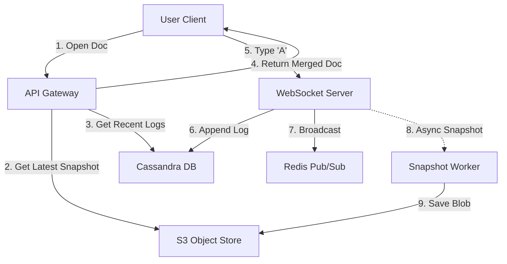

# Database Design: Google Docs System Architecture

## 1. High-Level Database Strategy (Polyglot Persistence)
In a system like Google Docs, a single database cannot handle all requirements. We separate **Metadata** (ACID consistency) from **Document Content** (High throughput/Real-time).

| Component | Nature of Data | Recommended DB | Why? |
| :--- | :--- | :--- | :--- |
| **User/Metadata** | Structured, relational, low write volume, requires strict consistency. | **Relational (PostgreSQL/MySQL)** | Complex joins needed for permissions and folder structures. |
| **Edit Logs (Content)** | Immutable stream of small events, massive write volume. | **NoSQL (Cassandra / DynamoDB)** | Fast writes, easy to shard by `doc_id`, handles time-series data efficiently. |
| **Snapshots** | Large binary/text blobs. | **Object Store (AWS S3)** | Cheaper storage; optimized for large retrieval (write once, read many). |
| **Hot Cache** | Ephemeral state (Active users, current doc state). | **Redis** | Sub-millisecond access for real-time collaboration. |

---

## 2. Detailed Schema Design

### A. Metadata Database (PostgreSQL)
This handles the "Drive" aspect: user management, folder structures, and permissions.

#### `Users` Table
```sql
CREATE TABLE Users (
    user_id BIGINT PRIMARY KEY,
    email VARCHAR(255) UNIQUE NOT NULL,
    username VARCHAR(50)
);
```
#### `Documents` Table
This table stores the essential metadata for every file. Note that we store a `current_version` pointer here to quickly identify the latest state of the document without scanning the entire edit log.

```sql
CREATE TABLE Documents (
    doc_id VARCHAR(64) PRIMARY KEY, -- UUID
    owner_id BIGINT REFERENCES Users(user_id),
    title VARCHAR(255),
    created_at TIMESTAMP DEFAULT CURRENT_TIMESTAMP,
    last_modified TIMESTAMP,
    current_version BIGINT DEFAULT 0 -- Pointer to the latest version
);
```
#### `Permissions` Table
This table implements the Access Control List (ACL). It is critical for security to ensure users can only access documents they are authorized for. We use a composite index on `doc_id` and `user_id` for extremely fast lookup during the authentication phase.

```sql
CREATE TABLE Permissions (
    permission_id BIGINT PRIMARY KEY,
    doc_id VARCHAR(64) REFERENCES Documents(doc_id),
    user_id BIGINT REFERENCES Users(user_id),
    access_level VARCHAR(20) CHECK (access_level IN ('READ', 'COMMENT', 'WRITE', 'OWNER')),
    INDEX(doc_id, user_id) -- Composite index for fast access checks
);
```
### B. Content Database (NoSQL - Cassandra/DynamoDB)
We use the **Event Sourcing** pattern for the actual document content. We do not update a single "text" field. Instead, we store the *stream of changes* (operations).

#### `Edit_Operations` Table
* **Pattern:** Write-heavy, Append-only.
* **Partition Key:** `doc_id` (Ensures all edits for one specific document stay on the same database node).
* **Clustering Key:** `version_number` (Orders edits sequentially).

```sql
-- Conceptual Cassandra (CQL) Schema
CREATE TABLE Edit_Operations (
    doc_id TEXT,
    version_number BIGINT,
    user_id BIGINT,
    op_type TEXT,     -- 'INSERT', 'DELETE', 'STYLE'
    position INT,     -- Cursor index
    payload TEXT,     -- The character(s) added
    timestamp TIMESTAMP,
    PRIMARY KEY ((doc_id), version_number)
) WITH CLUSTERING ORDER BY (version_number ASC);
```
### C. Snapshot Storage (Object Store + Metadata)
Replaying 100,000 small edits (like individual keystrokes) to load a document is too slow. We use snapshots to optimize the read path.

#### Strategy
Every $N$ operations (e.g., 500 edits), a background worker compiles the text into a full document file and saves it to S3. This significantly reduces the time required to open a large document.

#### `Snapshots` Table (Postgres)
This table acts as a pointer to the storage location of the compiled files.

```sql
CREATE TABLE Snapshots (
    doc_id VARCHAR(64),
    version_number BIGINT, -- The version this snapshot represents (e.g., v500)
    s3_url VARCHAR(255),   -- Link to the blob object (e.g., s3://docs-bucket/v500.json)
    created_at TIMESTAMP,
    PRIMARY KEY (doc_id, version_number)
);
```
## 3. Data Flow: The Read & Write Path

### The Write Path (User types 'A')
1.  **WebSocket Server** receives the edit `insert('A', index=5)`.
2.  Server applies **OT (Operational Transformation)** logic in memory to handle conflicts.
3.  Server persists the operation to the **`Edit_Operations`** table (Cassandra).
4.  Server updates the `current_version` in the **`Documents`** table (or Redis cache).
5.  Server broadcasts the change to other connected users via Redis Pub/Sub.
6.  *Async Process:* If `current_version % 500 == 0`, trigger a background job to create a new Snapshot.

### The Read Path (User opens a Doc)
1.  Client requests `doc_id = 123`.
2.  **Check Snapshots:** Server queries the `Snapshots` table for the highest available version (e.g., v5000).
3.  **Fetch Blob:** Server downloads the v5000 content from S3 (Object Storage).
4.  **Fetch Recent Logs:** Server queries `Edit_Operations` for `doc_id='123'` where `version_number > 5000`.
5.  **Merge:** Server applies the recent logs (e.g., v5001–v5005) on top of the snapshot.
6.  **Serve:** The fully constructed document is sent to the client.

---

## 4. Advanced Interview Questions (Database Focus)

**Q: How do you handle concurrency (Race Conditions) in the Database?**
> **Answer:** We use **Optimistic Locking** (often called Compare-and-Swap).
> * The database write condition is: `INSERT INTO Edit_Operations ... IF NOT EXISTS`.
> * If two users try to write "Version 101" simultaneously, one will succeed. The other will fail, receive an error, read the new state, transform their operation to "Version 102", and retry.

**Q: Why separate Metadata and Content?**
> **Answer:** They scale differently.
> * **Metadata** (Titles, Permissions) is read-heavy but low volume. It needs complex queries ("Find all docs shared with me"). SQL is perfect for this.
> * **Content** (Edits) is massive volume, simple structure (Key-Value/Log), and requires high write throughput. NoSQL (Cassandra) is perfect for this.

---

## 5. Visual Summary (Data Flow)

