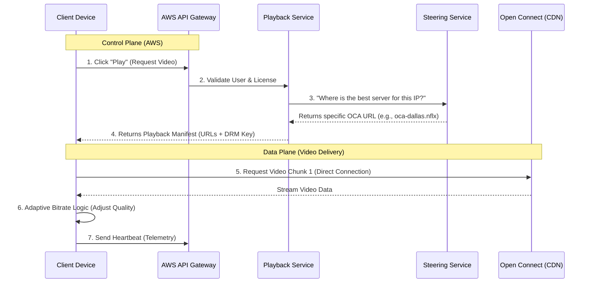

# Netflix Streaming High-Level Design: The "Click-to-Play" Workflow

When a user presses "Play," a massive orchestration occurs between two distinct worlds:
* **The Control Plane (AWS):** The "Brain" – Handles logic, authentication, and routing.
* **The Data Plane (Open Connect):** The "Muscle" – Handles the heavy video traffic.

The key to handling millions of concurrent users is that **video traffic never touches AWS**. AWS only handles the lightweight permission logic, while the heavy video data comes from edge servers located physically close to the user.

---

## 1. The "Click-to-Play" Workflow

### Step 1: The Request (Thundering Herd Management)
* **Action:** User clicks "Play."
* **Component:** **API Gateway (Zuul / Envoy)** on AWS.
* **Process:**
    * The request hits the API Gateway.
    * Gateway handles SSL termination and routing.
    * **Scale Strategy:** If millions of users click at once, the Gateway uses **adaptive throttling** to reject excess requests gracefully, ensuring the backend never crashes.

### Step 2: The Orchestration (Playback API)
* **Component:** **Playback Service** (Microservice).
* **Process:**
    * This service acts as the coordinator. It calls parallel microservices via gRPC:
        * **Subscriber Service:** Verifies active subscription.
        * **License Service (DRM):** Generates decryption keys for the specific device.
        * **Content Service:** Retrieves metadata (resolution, audio tracks).

### Step 3: The Steering (The Critical Step)
* **Component:** **Steering Service**.
* **The Problem:** There are thousands of Open Connect Appliances (OCAs) worldwide. Which one should the user connect to?
* **The Logic:**
    * The service analyzes the user's **IP Address** and **ISP**.
    * It checks the health/load of OCAs inside that specific ISP's data center.
    * **Scale Strategy:** It avoids overloaded servers. If the local server is 95% full, it "steers" the user to a nearby alternative.
* **Output:** It generates a **Playback Manifest** containing direct URLs to the video files (e.g., `https://oca-dallas-isp.netflix.com/...`).

### Step 4: The Handoff (Client Logic)
* **Action:** AWS returns the Manifest + DRM License to the user's device.
* **Transition:** The connection to the AWS Control Plane is now largely **finished**. The client possesses the map to find the video.

### Step 5: The Stream (Data Plane)
* **Component:** **Open Connect Appliance (OCA)**.
* **Process:**
    * The device opens a direct TCP/UDP connection to the OCA IP address from the manifest.
    * **Adaptive Bitrate (ABR):** The client requests the first 4 seconds. If download speed is high, it requests the next chunk in 4K. If low, it drops to 720p.
    * **Scale Strategy:** Traffic is strictly between User ↔ ISP-based OCA. It does not clog the public internet backbone.

---

## 2. Visualizing the Flow (Sequence Diagram)

---

## 3. Handling "Many Users" (Concurrency Strategy)

If 10 million people click play simultaneously, the system relies on three principles:

1.  **Bulkheading (Isolation):**
    * The "Streaming" infrastructure is isolated from "Browsing." If the Search service crashes due to load, users can still watch movies they have already started.

2.  **Stateless Control Plane:**
    * The AWS services (Playback, Steering) are **stateless**. Netflix can auto-scale by spinning up 5,000 extra copies of the Steering Service in minutes to handle a surge, then terminate them when traffic drops.

3.  **ISP Offloading (Decentralization):**
    * By placing servers *inside* ISPs (Verizon, Comcast, Jio, etc.), Netflix decentralizes the traffic.
    * 10 million users are not hitting one central data center; they are hitting thousands of tiny, distributed server racks local to their neighborhoods.

---

# 7. Senior Developer Q&A: Deep Dives & Edge Cases

This section addresses complex architectural decisions, trade-offs, and failure scenarios expected at a Senior/Staff Engineering level.

### Q1: Why did Netflix build its own CDN (Open Connect) instead of using established providers like Akamai or Cloudflare?
**The Trade-off:** *Buy vs. Build*

* **Cost Efficiency at Scale:** Third-party CDNs charge by the Gigabyte. For Netflix, which consumes ~15% of the world's total downstream bandwidth, the variable costs of a public CDN would be unsustainable.
* **ISP Integration:** Open Connect Appliances (OCAs) are physically installed *inside* ISP data centers. This removes the "middle mile" of the internet, eliminating peering congestion and transit costs for both Netflix and the ISP.
* **Proactive Caching:** Standard CDNs are "reactive" (caching content only after a user requests it). Netflix's workload is highly predictable. They know *precisely* what will be popular tomorrow (e.g., a new season launch). They use "Proactive Caching" to push content to OCAs during off-peak hours (4 AM), ensuring 100% cache hit ratios for top content without hammering the backbone during prime time.

### Q2: How does the system handle the "Thundering Herd" problem when a major show launches (e.g., 10M people clicking play at 8:00 PM)?
**The Concept:** *Thundering Herd & Bulkheading*

* **Pre-computation:** The "Steering Service" pre-calculates the optimal routes. It doesn't solve a complex graph problem every time you click play.
* **Bulkheading (Isolation):** The "Playback" service is isolated from the "Discovery" (browsing) service. If the homepage crashes due to traffic, users can still stream shows they have already started because the streaming connection is direct to the OCA, bypassing the backend entirely.
* **Shedding Load:** If the API Gateway detects CPU usage spiking above a safe threshold (e.g., 85%), it begins "Load Shedding." It drops low-priority requests (like background log uploads) to prioritize user-facing "Play" requests.
* **Client-Side Jitter:** The clients don't all retry instantly on failure. They use **Exponential Backoff with Jitter** (randomized wait times) to prevent hammering the server in synchronized waves.

### Q3: Why use Cassandra for "Viewing History"? Doesn't Eventual Consistency cause issues?
**The Trade-off:** *Consistency vs. Availability (CAP Theorem)*

* **Write Heavy Workload:** A user watching a show generates a "heartbeat" every few seconds. This creates millions of writes per second globally. SQL databases (MySQL/PostgreSQL) cannot handle this write throughput efficiently without massive sharding complexity.
* **Tunable Consistency:** Netflix uses Cassandra's **Eventual Consistency** model.
    * *Scenario:* If you watch a movie in New York, then fly to London 5 hours later, it's acceptable if the "Resume" bar is 10 seconds off. It is *not* acceptable for the database to be down.
    * *Design:* Netflix prioritizes **Availability** (AP in CAP). They use a consistency level of `ONE` or `LOCAL_QUORUM` for writing viewing history, accepting a tiny risk of data divergence in exchange for zero downtime.
* **Anti-Entropy:** They run background "repair" processes to sync data between regions eventually.

### Q4: How does the Adaptive Bitrate (ABR) algorithm actually work? Is it purely bandwidth-based?
**The Nuance:** *Buffer-based vs. Rate-based Algorithms*

* It is **not** just about bandwidth. If you rely only on bandwidth estimation, the video quality oscillates (flaps) wildly when network speed jitters.
* **Buffer-Based Logic:** The client looks at its local **Buffer Health**.
    * *Panic Mode:* If buffer < 5 seconds, download the smallest chunk (SD) immediately to keep playing.
    * *Safe Mode:* If buffer > 30 seconds, the client can afford to "risk" downloading a massive 4K chunk, even if current bandwidth is fluctuating, because it has a safety net.
* **Device Capability:** The client also checks battery life and CPU thermal throttling. It won't request 4K HDR on a phone with 5% battery, even if the WiFi is fast.

### Q5: What happens if an entire AWS Region (e.g., us-east-1) goes down?
**The Concept:** *Active-Active Multi-Region Replication*

* Netflix operates in an **Active-Active** model across multiple AWS regions (e.g., US-East, US-West, EU-West).
* **Data Replication:** Data is asynchronously replicated between regions using Cassandra's cross-region replication.
* **Traffic Evacuation:** If US-East fails, Netflix updates DNS entries (via Route53) to redirect *all* traffic to US-West or EU-West.
* **The Challenge:** The destination region must have "slack capacity" (extra idle servers) running at all times to absorb the sudden influx of millions of refugees. This is expensive but necessary for their guaranteed uptime.