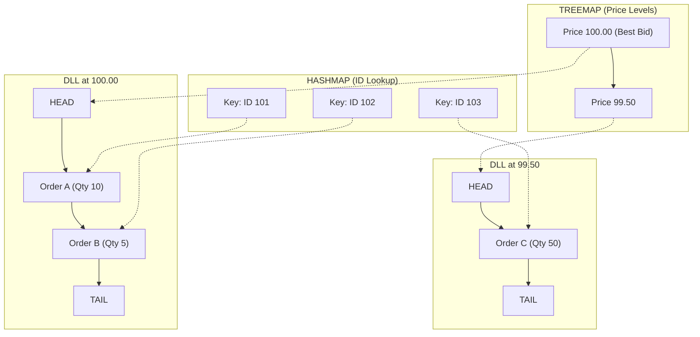
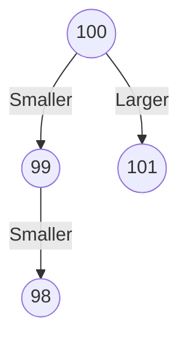

# System Design: Stock Exchange Matching Engine Implementation

This document details the core logic for a Stock Exchange Matching Engine. It contrasts the academic "Naive Approach" using Heaps against the "Professional Approach" used in high-frequency trading systems (TreeMap + DLL + HashMap).

---

## Approach 1: The Naive Approach (Heaps / PriorityQueues)

This approach uses Java's built-in `PriorityQueue`.
* **Pros:** Easy to implement; excellent for finding the "Best Price" quickly ($O(1)$).
* **Cons:** Terrible for **cancelling orders** ($O(N)$) because you must search the entire heap to find and remove an item.

### Java Implementation

```java
import java.util.PriorityQueue;
import java.util.Comparator;

class Order {
    int id;
    double price;
    int quantity;
    long timestamp; // For FIFO tie-breaking

    public Order(int id, double price, int quantity) {
        this.id = id;
        this.price = price;
        this.quantity = quantity;
        this.timestamp = System.nanoTime();
    }
}

public class HeapOrderBook {
    // Buy Side: MAX Heap (Highest price is best)
    // We sort by Price DESC, then by Time ASC (FIFO)
    PriorityQueue<Order> buyBook = new PriorityQueue<>(
        Comparator.comparingDouble((Order o) -> o.price).reversed()
                  .thenComparingLong(o -> o.timestamp)
    );

    // Sell Side: MIN Heap (Lowest price is best)
    // We sort by Price ASC, then by Time ASC (FIFO)
    PriorityQueue<Order> sellBook = new PriorityQueue<>(
        Comparator.comparingDouble((Order o) -> o.price)
                  .thenComparingLong(o -> o.timestamp)
    );

    public void addBuy(Order order) {
        buyBook.add(order);
        match();
    }

    public void addSell(Order order) {
        sellBook.add(order);
        match();
    }

    // The Matching Logic
    private void match() {
        while (!buyBook.isEmpty() && !sellBook.isEmpty()) {
            Order bestBuy = buyBook.peek();
            Order bestSell = sellBook.peek();

            // If Buy Price < Sell Price, no deal is possible
            if (bestBuy.price < bestSell.price) {
                break; 
            }

            // Match Logic
            int fillQty = Math.min(bestBuy.quantity, bestSell.quantity);
            System.out.println("Matched: " + fillQty + " @ " + bestSell.price);

            bestBuy.quantity -= fillQty;
            bestSell.quantity -= fillQty;

            // Remove filled orders
            if (bestBuy.quantity == 0) buyBook.poll();
            if (bestSell.quantity == 0) sellBook.poll();
        }
    }
}
```
# Stock Exchange Matching Engine: Professional Implementation

This document details the **Professional Approach** to building a Limit Order Book. This architecture is standard in high-frequency trading systems because it prioritizes **$O(1)$ order cancellation** and **$O(1)$ execution** at a specific price level.

---

## 1. The Architecture (TreeMap + DLL + HashMap)

To achieve constant-time operations for critical paths, we combine three data structures:

1.  **TreeMap (RB Tree):** Keeps the *Price Levels* sorted.
    * *Why?* It allows us to instantly find the "Best Bid" (highest price) and "Best Ask" (lowest price).
    * *Complexity:* Adding a new price level takes $O(\log M)$, where $M$ is the number of price levels (not orders).
2.  **Doubly Linked List (DLL):** Maintains the FIFO queue of orders *at that specific price*.
    * *Why?* It allows us to remove an order from the middle of the queue (cancellation) in $O(1)$ time without shifting the rest of the array.
3.  **HashMap:** Maps `OrderID` -> `OrderNode`.
    * *Why?* It provides a direct pointer to the node in the DLL, allowing for **$O(1)$ Cancellation**.

---

## 2. Java Implementation

```java
import java.util.*;

// --------------------------------------------------------
// 1. The Order Node (Doubly Linked List Node)
// Wrapper around an order that links to the Next/Prev order
// --------------------------------------------------------
class OrderNode {
    int orderId;
    double price;
    int quantity;
    OrderNode next;
    OrderNode prev;

    public OrderNode(int orderId, double price, int quantity) {
        this.orderId = orderId;
        this.price = price;
        this.quantity = quantity;
    }
}

// --------------------------------------------------------
// 2. The Limit Level (A Queue of Orders at a specific price)
// Contains the Head and Tail of the DLL for that price
// --------------------------------------------------------
class LimitLevel {
    double price;
    OrderNode head;
    OrderNode tail;

    public LimitLevel(double price) {
        this.price = price;
    }

    // Append to end of FIFO queue - O(1)
    public void append(OrderNode order) {
        if (head == null) {
            head = order;
            tail = order;
        } else {
            tail.next = order;
            order.prev = tail;
            tail = order;
        }
    }

    // Remove from middle of list - O(1)
    // This is the "Secret Sauce" for fast cancellations
    public void remove(OrderNode order) {
        if (order.prev != null) order.prev.next = order.next;
        if (order.next != null) order.next.prev = order.prev;
        
        // Update Head/Tail pointers if necessary
        if (order == head) head = order.next;
        if (order == tail) tail = order.prev;
        
        // Nullify links to help GC
        order.next = null;
        order.prev = null;
    }
    
    public boolean isEmpty() { return head == null; }
}

// --------------------------------------------------------
// 3. The Order Book Engine
// Manages the tree of LimitLevels and the Lookup Map
// --------------------------------------------------------
public class ProOrderBook {
    // TreeMap keeps prices sorted.
    // Buy Side: Reverse Order (High to Low) because highest bid is best
    TreeMap<Double, LimitLevel> bids = new TreeMap<>(Collections.reverseOrder());
    
    // Sell Side: Natural Order (Low to High) because lowest ask is best
    TreeMap<Double, LimitLevel> asks = new TreeMap<>();
    
    // Fast Lookups for Cancellation O(1)
    HashMap<Integer, OrderNode> orderMap = new HashMap<>();

    /**
     * Places an order into the book.
     * Complexity: O(log M) where M is number of price levels.
     */
    public void addOrder(int id, double price, int qty, boolean isBuy) {
        OrderNode order = new OrderNode(id, price, qty);
        orderMap.put(id, order);

        TreeMap<Double, LimitLevel> book = isBuy ? bids : asks;
        
        // Get or Create the Limit Level for this price
        book.putIfAbsent(price, new LimitLevel(price));
        book.get(price).append(order);
        
        // Trigger matching logic immediately
        match(); 
    }

    /**
     * Cancels an order by ID.
     * Complexity: O(1) - The critical performance feature.
     */
    public void cancelOrder(int orderId) {
        if (!orderMap.containsKey(orderId)) return;

        // 1. Find the node directly via HashMap
        OrderNode order = orderMap.get(orderId);
        
        // 2. Identify which book it belongs to
        TreeMap<Double, LimitLevel> book = bids.containsKey(order.price) ? bids : asks;
        LimitLevel level = book.get(order.price);

        // 3. Unlink from the DLL (O(1))
        level.remove(order);
        orderMap.remove(orderId);
        
        // 4. Cleanup: If that price level is now empty, remove it from the Tree
        if (level.isEmpty()) {
            book.remove(order.price);
        }
        System.out.println("Cancelled Order #" + orderId);
    }

    /**
     * Matches Bids vs Asks.
     * Complexity: O(1) per match event (processing the head of the list).
     */
    private void match() {
        while (!bids.isEmpty() && !asks.isEmpty()) {
            Double bestBidPrice = bids.firstKey();
            Double bestAskPrice = asks.firstKey();

            // If Buy Price < Sell Price, no deal is possible (Spread exists)
            if (bestBidPrice < bestAskPrice) break; 

            // Get the queues for these prices
            LimitLevel bidLevel = bids.get(bestBidPrice);
            LimitLevel askLevel = asks.get(bestAskPrice);
            
            // Get the first orders in the FIFO queue
            OrderNode bid = bidLevel.head;
            OrderNode ask = askLevel.head;

            // Calculate fill quantity
            int quantity = Math.min(bid.quantity, ask.quantity);
            System.out.println("Match Executed: " + quantity + " units @ $" + bestAskPrice);

            // Update quantities
            bid.quantity -= quantity;
            ask.quantity -= quantity;

            // Clean up filled orders from Book and Map
            if (bid.quantity == 0) {
                bidLevel.remove(bid);
                orderMap.remove(bid.orderId);
            }
            if (ask.quantity == 0) {
                askLevel.remove(ask);
                orderMap.remove(ask.orderId);
            }
            
            // Clean up empty price levels from Tree
            if (bidLevel.isEmpty()) bids.remove(bestBidPrice);
            if (askLevel.isEmpty()) asks.remove(bestAskPrice);
        }
    }
}
```

# Comparison: Why the Professional Method Wins

When building a high-frequency trading engine, the choice of data structure defines the latency profile. Below is the complexity comparison between the Naive approach (Priority Queues/Heaps) and the Professional approach (TreeMap + Doubly Linked List + HashMap).

## Complexity Analysis

| Operation | Naive Heap Approach | Professional Map + DLL Approach |
| :--- | :--- | :--- |
| **Get Best Price** | $O(1)$ | $O(1)$ (via `TreeMap.firstEntry`) |
| **Add Order** | $O(\log N)$ | $O(\log M)$ |
| **Cancel Order** | **$O(N)$** | **$O(1)$** |
| **Execute Trade** | $O(\log N)$ | $O(1)$ |

* **N** = Total number of orders in the book.
* **M** = Total number of *price levels* (usually much smaller than N).

## The Critical Differentiator: Cancellation Speed

The most glaring difference is in **Order Cancellation**.

### 1. The Naive Heap Problem ($O(N)$)
In a Priority Queue (Heap), finding an arbitrary item to remove requires scanning the underlying array.
* If you have **1,000,000 orders** in the book, a cancellation might require scanning 1,000,000 items.
* This introduces massive, unpredictable latency spikes.

### 2. The Professional Solution ($O(1)$)
By using a **HashMap** to store a direct pointer to the `OrderNode` inside the **Doubly Linked List**:
* The engine jumps directly to the node in memory.
* It unlinks the node (updating `prev` and `next` pointers) instantly.
* The cost is constant, regardless of whether there are 10 orders or 10 million orders.

### 3. Why This Matters
In modern markets, **90% to 95% of all orders are cancelled** without ever being traded. Market Makers constantly adjust their quotes (cancelling and re-submitting) to track the underlying asset price. If cancellation is slow, the entire exchange slows down, and Market Makers will pull their liquidity.

# Stock Exchange Matching Engine Architecture
### The Treemap + Hashmap + Double Linked List Pattern

This document outlines the classic high-frequency trading (HFT) design pattern used to build low-latency matching engines. It combines three distinct data structures to optimize for **Price-Time Priority** matching and rapid order management.

---

## 1. High-Level Concept

To run an exchange efficiently, the engine must satisfy conflicting performance requirements:
1.  **Fast Matching:** Quickly find the best price (Highest Bid / Lowest Ask).
2.  **Fairness (FIFO):** Orders at the same price must be matched based on arrival time.
3.  **Fast Management:** Traders need to cancel or modify orders instantly, regardless of where the order sits in the queue.

### The Trio of Data Structures

| Structure | Role | Key Benefit |
| :--- | :--- | :--- |
| **Treemap** | The "Price Ladder" | Keeps price levels sorted. Allows $O(\log N)$ or $O(1)$ access to the Best Bid/Ask. |
| **Double Linked List (DLL)** | The "Time Queue" | Manages FIFO priority at a specific price. Allows $O(1)$ insertion at tail and $O(1)$ removal from *anywhere* (head, tail, or middle). |
| **Hashmap** | The "Lookup Index" | Maps `OrderID` $\to$ `OrderNode`. Allows $O(1)$ direct access to an order for cancellation without searching. |

---

## 2. Architecture Visualization

The following diagram illustrates the **BUY (BID)** side of the order book. The Sell side is identical but sorted in reverse price order.



---

## 3. Detailed Workflows

### A. New Limit Order Submission
*Example: BUY 10 shares @ $100.00*

1.  **Check Match:** Engine checks Sell Book. If no match, proceed to rest the order.
2.  **Find Price Level (Treemap):** Query Treemap for `$100.00`.
    * *Found:* Retrieve existing Price Level object.
    * *Not Found:* Create new Price Level and new empty DLL. Insert into Treemap ($O(\log N)$).
3.  **Append (DLL):** Create `OrderNode`. Link it to the **Tail** of the `$100.00` DLL ($O(1)$). This preserves Time Priority.
4.  **Index (Hashmap):** Add `OrderID` $\to$ `OrderNode` pointer to Hashmap ($O(1)$).

### B. Order Cancellation (The "Hybrid" Strength)
*Example: Cancel Order ID 102 (which is stuck in the middle of a queue)*

1.  **Locate (Hashmap):** Query Hashmap for ID `102`. Get direct pointer to **Order B** node. ($O(1)$).
2.  **Unlink (DLL):**
    * Because the node has `Next` and `Prev` pointers:
    * `OrderB.Prev.Next = OrderB.Next`
    * `OrderB.Next.Prev = OrderB.Prev`
    * The node is removed from the chain instantly ($O(1)$). No traversal required.
3.  **Cleanup:** Remove ID from Hashmap. If DLL is now empty, remove Price Level from Treemap.

### C. Matching (Execution)
*Example: Incoming Market SELL for 12 shares*

1.  **Find Best Price:** Access highest key in Buy Treemap ($100.00$). ($O(1)$ cached access).
2.  **Access Queue:** Go to Head of the `$100.00` DLL.
3.  **Execute (FIFO):**
    * **Order A (Qty 10):** Fully matches 10 shares. Order A removed from Head ($O(1)$) and Hashmap ($O(1)$).
    * **Order B (Qty 5):** Partially matches remaining 2 shares. Order B quantity updated to 3. Remains at Head.
4.  **Result:** Market order filled.

---

## 4. Time Complexity Analysis

| Operation | Structure Used | Complexity | Notes |
| :--- | :--- | :--- | :--- |
| **Get Best Bid/Ask** | Treemap | $O(1)$ or $O(\log N)$ | Usually $O(1)$ via cached pointer to tree extreme. |
| **Add New Price** | Treemap | $O(\log N)$ | Balancing the Red-Black tree. |
| **Add Order (Rest)** | DLL (Tail) | $O(1)$ | Appending to list. |
| **Cancel Order** | Hashmap + DLL | $O(1)$ | **Crucial:** Direct lookup + pointer unlinking. |
| **Execute Match** | DLL (Head) | $O(1)$ | Popping from list. |

*Note: $N$ in Treemap refers to active price levels. $N$ in Hashmap refers to total active orders.*

# Understanding the Treemap Data Structure

In the context of Computer Science and Stock Exchange Matching Engines, a **Treemap** is a specialized data structure used to store key-value pairs in a **sorted order**.

It is distinct from a *HashMap*, which stores data in random order, and it is unrelated to the visual charts (colorful boxes) often seen in data analytics.

---

## 1. What is a Treemap?

A Treemap is a map that maintains its keys in a specific order (ascending or descending).

* **HashMap:** Focuses on speed. It scatters data randomly in memory. Finding a specific item is fast ($O(1)$), but finding the "highest" or "lowest" number requires scanning the entire list.
* **Treemap:** Focuses on order. It organizes data in a Tree structure. Finding the "highest" or "lowest" number is instantaneous.

---

## 2. How it Works (The Red-Black Tree)

Under the hood, a Treemap typically uses a **Self-Balancing Binary Search Tree (BST)**, most commonly a **Red-Black Tree**.

### The Logic
1.  **Root:** The tree starts with a single top node.
2.  **Left Child:** Any key **smaller** than the current node goes to the left.
3.  **Right Child:** Any key **larger** than the current node goes to the right.

### Visualization
Imagine we insert the prices `100`, `99`, `101`, and `98` into a Treemap.



* **To find the Lowest Price:** The engine simply traverses all the way down the **Left** side.
* **To find the Highest Price:** The engine traverses all the way down the **Right** side.

---

## 3. Why is this critical for Stock Exchanges?

A Matching Engine runs on **Price-Time Priority**.
* **Price Priority** means the engine must *always* match the **Highest Buy** against the **Lowest Sell** before anything else.

If we used a **HashMap**:
* We would have a bucket of prices: `{99, 100, 98, 101}`.
* To find the best price, the computer has to ask: "Is 99 the highest? No. Is 100? No. Is 101? Yes."
* This takes $O(N)$ time (scanning every order), which is too slow for HFT.

By using a **Treemap**:
* The prices are already sorted in the tree structure.
* The engine grabs the **Right-most node** to get the Best Bid instantly.
* This takes $O(\log N)$ or $O(1)$ (cached) time.

---

## 4. Comparison: Treemap vs. HashMap

| Feature | HashMap | TreeMap |
| :--- | :--- | :--- |
| **Ordering** | Random / Unsorted | **Always Sorted** |
| **Find Specific Key** | Very Fast ($O(1)$) | Fast ($O(\log N)$) |
| **Find Min/Max Key** | Slow ($O(N)$) | **Very Fast ($O(\log N)$)** |
| **Internal Structure** | Array of Buckets | Red-Black Tree |
| **Matching Engine Role** | Looking up Order IDs | **Maintains the Price Ladder** |