# System Design Architecture: Stock Exchange

The system design of a stock exchange is a specialized problem because it prioritizes **extreme low latency** (microseconds) and **strict ordering** over almost everything else. Unlike a standard web app where "eventual consistency" is acceptable, a stock exchange must be deterministic and incredibly fast.

Below is the high-level architecture broken down by its critical path.

---

## 1. High-Level Architecture

The system is generally divided into two main flows: the **Transactional Path** (accepting and matching orders) and the **Market Data Path** (broadcasting prices to the world).

### A. The Transactional Path (The "Hot" Path)
This path handles the buying and selling. It must be synchronous and sequential to ensure fairness.

#### 1. Order Gateway (FIX Gateway)
* **Role:** The entry point for clients (brokers/traders). It accepts orders using standard protocols like **FIX** (Financial Information eXchange).
* **Task:** It performs basic validation (e.g., "Is this a valid symbol?"), authentication, and translates the message into an internal binary format for speed.
* **Design:** Uses lightweight non-blocking I/O (like Netty in Java or epoll in C++) to handle thousands of connections.

#### 2. Risk Management Engine
* **Role:** The "Bouncer." Before an order reaches the market, it must pass pre-trade risk checks.
* **Task:** Checks limits (e.g., "Does this user have enough cash?" or "Is the order too large?").
* **Latency:** This must happen in sub-microseconds; otherwise, the trading experience feels slow.

#### 3. The Matching Engine (The Core)
* **Role:** This is the heart of the exchange. It matches Buy orders with Sell orders.
* **Data Structure:** Uses an **Order Book** (usually Limit Order Books).
    * **Buy Side (Bids):** Max-Heap (Highest price at top).
    * **Sell Side (Asks):** Min-Heap (Lowest price at top).
* **Algorithm:** Typically **FIFO** (First-In-First-Out). If two people bid the same price, the one who arrived first gets the trade.
* **Architecture:** To avoid locking contention, the matching engine for a specific symbol (e.g., AAPL) is often **single-threaded** and pinned to a specific CPU core. This avoids context switching overhead, making it faster than a multi-threaded approach.

### B. The Market Data Path (The "Broadcasting" Path)
Once a trade occurs, the world needs to know immediately.

#### 1. Market Data Publisher (Ticker Plant)
* **Role:** Capturing "Match Events" from the engine and broadcasting them.
* **Protocol:** Uses **UDP Multicast**. Unlike TCP (which is one-to-one), UDP Multicast sends a single packet that multiple subscribers (Hedge funds, news terminals) can "listen" to simultaneously. This ensures everyone gets the price update at the exact same time.

---

## 2. Key Design Constraints & Solutions

To achieve the necessary speed and reliability, exchanges use unique design patterns:

### Sequencer / Event Sourcing
Instead of writing to a database immediately (which is too slow), every incoming order is assigned a sequence number and written to a fast append-only log (journal). If the system crashes, it "replays" the log to restore the state of the Order Book.

### In-Memory Processing
The entire Order Book lives in **RAM**. No disk I/O occurs on the critical trading path.

### Hardware Alignment
* **Kernel Bypass:** They use specialized network cards (Solarflare) that allow the application to read data directly from the network cable, skipping the Operating System's network stack (Kernel) to save microseconds.
* **Co-location:** High-frequency trading firms pay to place their servers in the same physical data center as the exchange to minimize the speed of light travel time through fiber cables.

---

## 3. Visualizing the Flow (Mermaid.js)

```mermaid
sequenceDiagram
    participant User
    participant Gateway
    participant Sequencer
    participant MatchEngine
    participant Pub as MarketData_Publisher
    participant Sub as Subscribers

    User->>Gateway: New Order (Buy 100 XYZ @ $150)
    Gateway->>Gateway: Validate & Auth
    Gateway->>Sequencer: Send to Log
    Sequencer->>Sequencer: Assign ID #101 & Persist
    Sequencer->>MatchEngine: Push Order #101
    
    rect rgb(240, 240, 240)
        Note right of MatchEngine: ⚡ Critical Path (In-Memory)
        MatchEngine->>MatchEngine: Check Order Book
        MatchEngine->>MatchEngine: Match Found!
        MatchEngine->>MatchEngine: Update Book (Remove Sell)
    end
    
    MatchEngine->>Pub: Match Event (100 XYZ @ $150)
    Pub-->>Sub: UDP Multicast (Price Update)
    MatchEngine->>Gateway: Execution Report
    Gateway->>User: "Order Filled"
```

---

## 4. Deep Dive: Matching Algorithm Edge Cases

The standard Matching Engine logic (FIFO) handles "Limit Orders" easily. However, "Conditional Orders" like **Stop-Loss** introduce complexity because they rely on external triggers.

### Handling Stop-Loss Orders
A Stop-Loss order is an instruction to sell (or buy) a security once it reaches a certain price, designed to limit an investor's loss.

1.  **The "Stop Book" (Separate List):** Stop orders are **not** placed in the main Order Book. Instead, they are stored in a separate, auxiliary data structure called the **Stop Book**.
2.  **The Trigger Mechanism:** Every time a *trade* occurs in the main engine, the engine checks the "Last Traded Price" (LTP).
3.  **The Transformation:** If the condition is met (e.g., Stock drops to $90), the engine moves the order from the **Stop Book** into the **Main Order Book**, treating it as a brand new order (it loses previous time priority).

### Handling "Immediate or Cancel" (IOC)
1.  The engine attempts to match against the top of the book.
2.  If only partial quantity is available, it fills that partial amount.
3.  The engine explicitly **discards** the remainder rather than adding it to the book.

---

## 5. Post-Trade Architecture: Settlement & Database Schema

While the Matching Engine runs in memory for speed, the **Post-Trade** system runs on disk (databases) for reliability. It must be **ACID compliant**.

**Key Technology:** Relational Databases (PostgreSQL, Oracle, or SQL Server).

### Core Database Schema

#### A. `orders_history`
This is the permanent record of every intent to trade.
* `order_id` (PK)
* `user_id` (FK)
* `symbol`, `side`, `type`, `status`, `created_at`

#### B. `trades` (The Match)
Links a Buyer and a Seller.
* `trade_id` (PK)
* `buy_order_id` (FK), `sell_order_id` (FK)
* `quantity`, `price`, `execution_time`

#### C. `positions` (Inventory)
Tracks what a user currently owns.
* `user_id` (FK), `symbol`
* `quantity` (Current holding)

#### D. `ledger` (Double-Entry Accounting)
Ensures money is never created or destroyed.
* `transaction_id` (PK)
* `user_id` (FK)
* `amount` (Positive for credit, Negative for debit)
* `entry_type` (DEPOSIT, WITHDRAWAL, TRADE_SETTLEMENT)

## 3. Summary Workflow

1.  **User** sends "Buy 100 shares of XYZ" via **Gateway**.
2.  **Sequencer** assigns ID #101 to the order and logs it.
3.  **Matching Engine** reads order #101 from memory.
4.  **Engine** checks the Book: "Is there a Sell order for XYZ at this price?"
    * *If Yes:* Match executed.
    * *If No:* Add order to the "Buy" side of the Book.
5.  **Publisher** blasts "Trade Executed: 100 XYZ" via UDP Multicast to all market data subscribers.