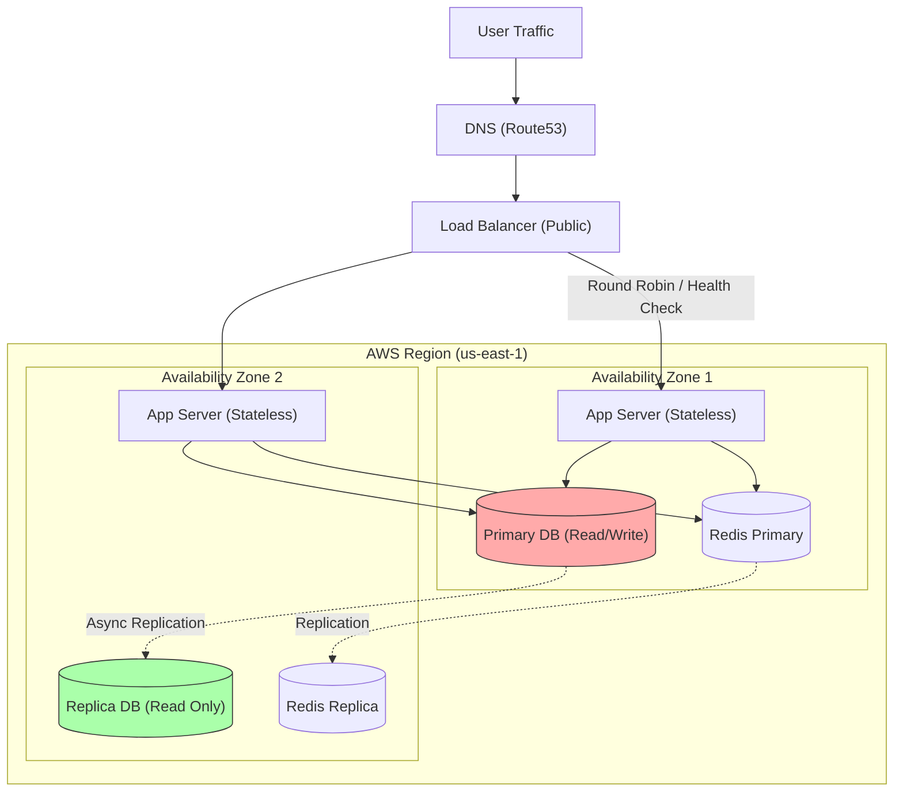

# High Availability & Resilience: System Design Patterns

## 1. The Core Concepts
* **High Availability (HA):** The goal of ensuring your system is operational (Uptime) for a high percentage of time (e.g., 99.99%). It focuses on **Redundancy** (eliminating Single Points of Failure).
* **Resilience:** The ability of the system to **recover** from failures and continue functioning, perhaps in a degraded state. It focuses on **Fault Tolerance**.

### The Golden Formula
$$Availability = \frac{MTBF}{MTBF + MTTR}$$
* **MTBF:** Mean Time Between Failures (How rarely do we break?).
* **MTTR:** Mean Time To Recovery (How fast do we fix it?).
* *Goal:* Maximize MTBF, Minimize MTTR.

---

## 2. The Architecture: Multi-AZ & Redundancy

To achieve HA, we use a **Shared-Nothing Architecture** spread across multiple physical locations (Availability Zones).

### Visual Architecture (Standard HA Pattern)

### Key Components Explained
1.  **Load Balancer (The Traffic Cop):** Distributes traffic across healthy instances. If App1 dies, the LB detects it (Health Check fails) and routes 100% traffic to App2.
2.  **Stateless Application Layer:** Servers should not store session data locally. Store sessions in Redis. This allows you to kill/add servers at will (Auto-scaling).
3.  **Database Replication (Active-Passive):**
    * **Primary:** Handles all Writes.
    * **Replica:** Copies data from Primary. Can handle Reads.
    * **Failover:** If Primary dies, an automated script promotes the Replica to Primary.

---

## 3. Resilience Patterns (The "Software" Safety Nets)

Hardware redundancy isn't enough. Software bugs cause crashes too.

### A. Circuit Breaker
* **Scenario:** A 3rd-party Payment API is down. Your app waits 30s for a timeout on every request. All threads get blocked. The whole site crashes.
* **Pattern:** Wrap the call in a Circuit Breaker.
    * *Closed:* Normal operation.
    * *Open:* If failures > 50%, stop calling the API immediately. Throw an error instantly.
    * *Half-Open:* After 1 minute, let 1 request through to test if it's back up.

### B. Bulkhead Pattern (The "Titanic" Logic)
* **Scenario:** The "Image Upload" feature is slow/buggy. It consumes all server threads. Now "User Login" (which is lightweight) also fails because no threads are left.
* **Pattern:** Isolate resources. Allocate Thread Pool A for Uploads and Thread Pool B for Login. If A fills up, B still works.

### C. Graceful Degradation
* **Scenario:** The "Recommendation Engine" fails.
* **Pattern:** Don't show a 500 Error. Show a static list of "Top 10 items" or hide the recommendation widget entirely. The core site (Checkout) must still work.

### D. Exponential Backoff (Retry Storms)
* **Scenario:** DB momentarily blips. 10,000 users retry immediately. The DB comes back, gets hit by 10k requests, and crashes again.
* **Pattern:**
    * Retry 1: Wait 100ms.
    * Retry 2: Wait 200ms.
    * Retry 3: Wait 400ms + **Jitter** (Randomness).

---

## 4. Senior Interview Q&A

### Q1: "Active-Active vs. Active-Passive: Which one and why?"
**Senior Answer:**
"It depends on the **RTO (Recovery Time Objective)** and **Cost**.
* **Active-Passive:** Cheaper. One node handles traffic; the other is idle. Failover takes seconds/minutes (Promoting DB). Good for most standard apps.
* **Active-Active:** Expensive. Both nodes handle traffic. Complex data synchronization (bi-directional replication) is required to prevent conflicts. Required for mission-critical systems where downtime must be zero."

### Q2: "How do you handle a 'Thundering Herd' problem?"
**Senior Answer:**
"This happens when a cache (Redis) expires, and thousands of requests hit the DB simultaneously to rebuild it.
* **Solution 1:** **Cache Stampede Protection (Locking).** Only one process rebuilds the cache; others wait.
* **Solution 2:** **Jitter.** Randomize the TTL of cache keys so they don't all expire at the exact same second."

### Q3: "Explain Chaos Engineering."
**Senior Answer:**
"It is the practice of intentionally injecting failure into a system to test resilience (e.g., Netflix Chaos Monkey). We randomly terminate EC2 instances or add network latency in production (or staging) to verify that our Auto-Scaling Groups and Circuit Breakers actually trigger as expected."

### Q4: "What is Split Brain and how do we prevent it?"
**Senior Answer:**
"In a cluster, if the network acts up, Node A and Node B might lose connection. Both think the other is dead, so both elect themselves as Master. They both accept writes, leading to data corruption.
* **Prevention:** Use a **Quorum** (Odd number of nodes). A node can only become Master if it can talk to the majority (N/2 + 1). If a node is isolated, it steps down."

### Q5: "How does a Load Balancer know a server is 'Unhealthy'?"
**Senior Answer:**
"Through **Health Checks**. The LB pings a specific endpoint (e.g., `/health`) every 5 seconds.
* **Shallow Check:** Returns 200 OK if the app is running.
* **Deep Check:** The app checks its own DB/Redis connection before returning 200 OK.
* *Warning:* Deep checks can be dangerous. If the DB slows down, *all* app servers might fail their deep health checks simultaneously, causing the LB to remove all instances and taking the site down (Cascading Failure)."