```mermaid
flowchart TD
    Browser["Web Browser"] --> Web["Presentation Layer <br/> (Controllers)"]
    Web --> Business["Business Logic Layer <br/> (Services/Rules)"]
    Business --> Persistence["Persistence Layer <br/> (ORM/DAO)"]
    Persistence --> DB[("Database")]

    %% Strict enforcement - Fixed Syntax
    Web -.->|"❌ Forbidden (Bypass)"| Persistence
    
    style Business fill:#fff2cc,stroke:#333
```

# High-Level Design Architectures: The Complete Guide

## 1. Monolithic Architecture (The Classic)
**Concept:** The entire application (User Interface, Business Logic, Data Access) is built as a single deployable unit (e.g., one huge `.jar` or `executable`).

* **Pros:** Simple to develop/test initially; Easy deployment (copy one file); No network latency between modules.
* **Cons:** Single Point of Failure (a bug in one module crashes everything); Hard to scale teams (merge conflicts); Technology lock-in.

### Visual Architecture

---

## 2. Microservices Architecture (The Standard)
**Concept:** The application is broken down into small, independent services based on **Business Domains** (e.g., Order Service, User Service). Each service has its own database.

* **Pros:** Independent scaling (Scale "Orders" but not "Users"); Technology agnostic (Python for AI, Java for Banking); Fault isolation.
* **Cons:** Distributed complexity (Network latency, eventual consistency); DevOps heavy (Kubernetes, Service Mesh required).

### Visual Architecture

---

## 3. Event-Driven Architecture (EDA)
**Concept:** Services do not call each other directly (Synchronous). Instead, they emit "Events" to a Message Broker. Consumers react to these events asynchronously.

* **Pros:** Extreme decoupling; Handling bursts (Broker acts as a buffer); Good for real-time analytics.
* **Cons:** Hard to trace/debug (Where did the message go?); Complexity in handling duplicate messages (Idempotency required).

### Visual Architecture

---

## 4. Layered (N-Tier) Architecture
**Concept:** Code is organized into horizontal layers with specific responsibilities. A layer can only talk to the layer directly below it.

* **Pros:** Separation of concerns; Easy to replace a layer (e.g., switch from React to Angular without touching the backend).
* **Cons:** "Sinkhole Anti-pattern" (Request passes through layers doing nothing but forwarding data); Performance overhead (multiple hops).

### Visual Architecture

---

## 5. Serverless Architecture (FaaS)
**Concept:** The cloud provider manages the server allocation. You just write code (Functions) that triggers on events (HTTP Request, S3 Upload).

* **Pros:** Zero server management; Pay only for execution time (Cost effective for sporadic traffic); Infinite auto-scaling.
* **Cons:** **Cold Starts** (Latency when a function runs after being idle); Vendor Lock-in (AWS Lambda logic is hard to move to Azure Functions).

### Visual Architecture

---

## 6. Senior Interview Q&A

### Q1: "When would you choose Monolith over Microservices today?"
**Senior Answer:**
"I would choose a **Modular Monolith** for early-stage startups or domains with low complexity.
1.  **Speed:** Faster to iterate when you don't have to manage 20 Git repos and CI/CD pipelines.
2.  **Cost:** Cheaper infrastructure (one load balancer, one DB cluster).
3.  **Team Size:** If the team is < 10 people, the overhead of Microservices (Service Mesh, distributed tracing) slows development down rather than speeding it up."

### Q2: "In Event-Driven Architecture, how do you choose between Choreography and Orchestration?"
**Senior Answer:**
* **Choreography (Decentralized):** Service A emits an event, B and C listen. No one 'manager' knows the whole flow. Good for loose coupling, but hard to visualize the business process.
* **Orchestration (Centralized):** A 'Saga Orchestrator' (e.g., Temporal.io, Step Functions) tells Service A to run, then Service B. Good for complex transactions where you might need to **Rollback** (Compensating Transactions) if a step fails."

### Q3: "How do you solve the 'Database per Service' reporting problem?"
**Senior Answer:**
"If every microservice has its own DB, you can't run a `JOIN` query for analytics.
**Solution:** implement the **CQRS Pattern** (Command Query Responsibility Segregation).
1.  Services write to their own operational DBs.
2.  An ETL pipeline (or Kafka Connect) streams data changes to a central **Data Warehouse** (Snowflake/Redshift) or a Read-Optimized View (Elasticsearch).
3.  Analytics/Reporting queries run against this central Read-Only store."

### Q4: "What is the Backends-for-Frontends (BFF) pattern?"
**Senior Answer:**
"It is a variation of Layered Architecture used in Microservices. Instead of one giant API Gateway for everyone, you build specific Gateways for specific clients.
* **Mobile BFF:** Strips out heavy data to save bandwidth.
* **Web Desktop BFF:** Returns rich data.
* This prevents the 'Over-fetching' problem where a mobile app downloads 2MB of JSON but only uses 3 fields."