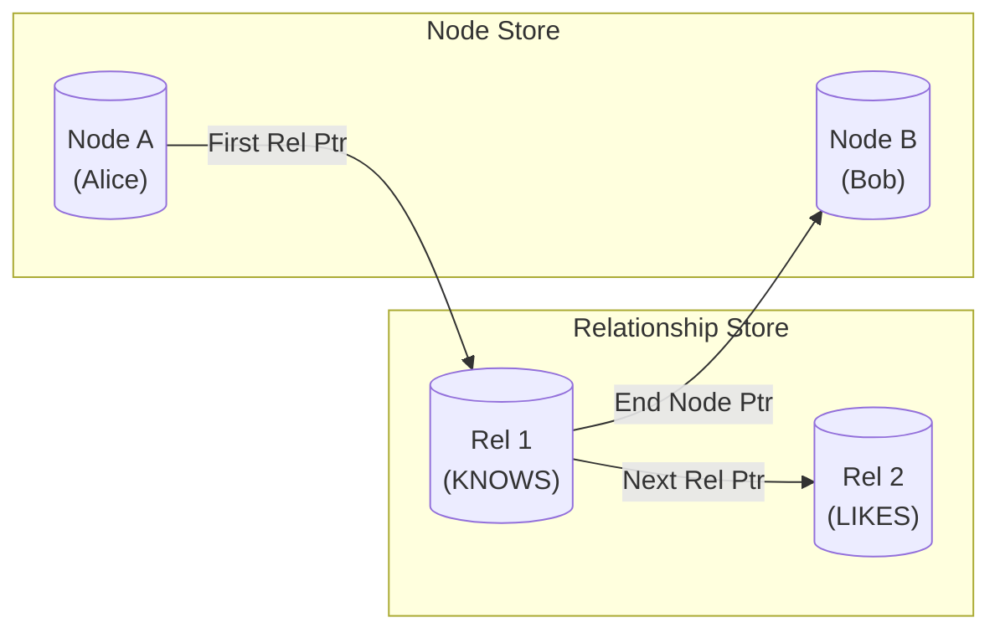

# Internal Working of Index-Free Adjacency in Graph Databases

This document details the internal engineering of **Index-Free Adjacency**, the core mechanism that powers Native Graph Databases (like **Neo4j** and **TigerGraph**), enabling them to perform complex relationship traversals millions of times faster than relational databases.

---

## 1. The Core Concept: The "Join" Problem
To understand why Index-Free Adjacency exists, we must look at how Relational Databases (SQL) handle relationships.

* **SQL Approach (Joins):** To find "Alice's friends", SQL uses a **Join Table**.
    * It takes Alice's ID.
    * It scans a global B-Tree Index to find entries matching Alice.
    * **Complexity:** $O(\log N)$. As the total data ($N$) grows, the query slows down.
* **Graph Approach (Index-Free):**
    * The database does not scan a global index.
    * Alice's node physically contains the memory address of her friends.
    * **Complexity:** $O(k)$, where $k$ is the number of Alice's friends. The total size of the database ($N$) does not affect speed.

---

## 2. Internal Structure: Fixed-Size Records
The secret to this speed is how data is laid out on the disk. Unlike document stores (which have variable-size JSON), graph databases often use **Fixed-Size Records**.

### A. The Node Store
Every node is stored as a fixed-size block (e.g., 15 bytes).
* **ID:** Calculated by offset (Byte `0` is Node 0, Byte `15` is Node 1).
* **Pointer:** Contains the ID of the **first relationship** connected to this node.
* **Pointer:** Contains the ID of the **first property** (key-value pair).

### B. The Relationship Store
Every relationship (edge) is also a fixed-size block (e.g., 34 bytes). It acts as a **Doubly Linked List** connecting two nodes.
It stores:
1.  **Start Node ID:** Who is this edge coming from?
2.  **End Node ID:** Who is this edge going to?
3.  **Prev Relationship ID:** Pointer to the previous edge for the Start Node.
4.  **Next Relationship ID:** Pointer to the next edge for the Start Node.

> **[Diagram: Visualizing the Node and Relationship Store on Disk]**

## 3. Internal Working: The Traversal (Pointer Hopping)

When you run a query like `MATCH (Alice)-[:KNOWS]->(Friend)`, the engine performs a process known as **"Pointer Hopping."**

### Step 1: Locate Starting Node
The engine looks up "Alice". If "Alice" is indexed, it uses a B-Tree **once** to find her Node ID (e.g., Node `100`).

### Step 2: Access Physical Memory
Because records are **fixed-size** (e.g., 15 bytes), the engine knows exactly where Node `100` lives on the disk without searching:

$$\text{Disk Offset} = 100 \times 15 \text{ bytes}$$

It performs **1 seek** to jump straight to that location.

### Step 3: Follow the Chain
1.  The engine reads the **"First Relationship ID"** stored in Alice's node.
2.  It jumps directly to that Relationship record.
3.  It reads the **"End Node ID"** in that record to find the "Friend".
4.  It reads the **"Next Relationship ID"** to find the next friend.

> **Why is this fast?**
> This process involves **dereferencing pointers** (memory addresses). It completely skips the layer of software logic that manages indices, effectively running at the speed of the hardware RAM or Disk cache.

---

## 4. Comparison: Native Graph vs. Non-Native

Many databases claim to be "Graph" (e.g., a Graph layer on top of Cassandra or HBase), but they are **Non-Native**.

| Feature | Native Graph (Index-Free) | Non-Native (Index-Based) |
| :--- | :--- | :--- |
| **Storage** | Fixed-size records with pointers | Rows or Documents in B-Trees |
| **Traversal** | Follow memory pointers | Scan Global Index for every hop |
| **Complexity** | $O(k)$ (neighbors) | $O(\log N)$ (total data) |
| **Performance** | Constant speed as data grows | Slows down as data grows |
| **Example** | **Neo4j, TigerGraph** | **JanusGraph, Amazon Neptune** |

---

## 5. Summary

**Index-Free Adjacency** is the defining characteristic of high-performance graph databases. By treating relationships as physical memory pointers rather than logical data dependencies, it converts complex join operations into simple linked-list traversals.