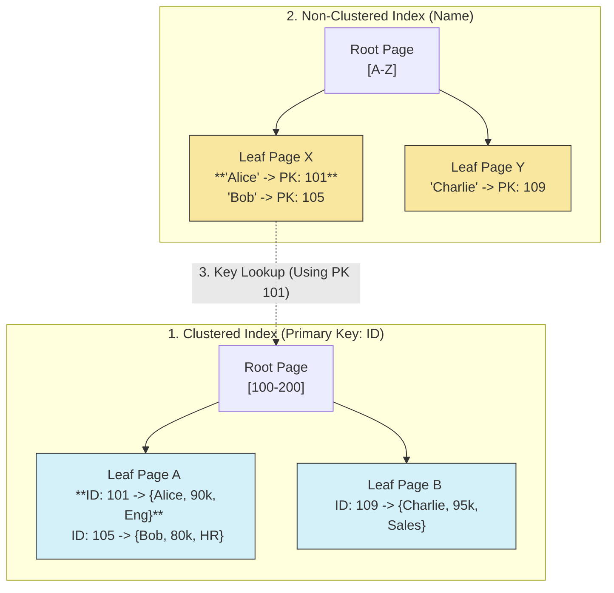

# SQL Indexing Internals: B+ Tree Traversal & Storage

## 1. The Setup: Sample Data
To explain the traversal, we assume an `Employees` table with 1 Million rows.

```sql
CREATE TABLE Employees (
    EmployeeID INT PRIMARY KEY,  -- Clustered Index
    Name VARCHAR(50),            -- Non-Clustered Index
    Salary INT,
    Department VARCHAR(50)
);

-- We add a secondary index on Name
CREATE INDEX idx_name ON Employees(Name);
```

**Sample Data:**

| EmployeeID (PK) | Name | Salary | Department |
| :--- | :--- | :--- | :--- |
| **101** | Alice | 90,000 | Eng |
| **105** | Bob | 80,000 | HR |
| **109** | Charlie | 95,000 | Sales |

---

## 2. Visual Architecture (B+ Tree)

This diagram shows how the two indexes physically exist and interact.



---

## 3. Query Traversal Walkthrough

Here is exactly what the Database Engine does for different SQL operations.

### Scenario A: Clustered Index Seek (Fastest)
**Query:**
```sql
SELECT * FROM Employees WHERE EmployeeID = 101;
```

**Traversal Steps:**
1.  **Parse:** DB sees `WHERE EmployeeID = ...`. Since `EmployeeID` is the Clustered Key, it goes to the Main Tree.
2.  **Root Node:** Reads Root Page. Finds pointer for range `100-200`.
3.  **Leaf Node:** Traverses to `Leaf Page A`.
4.  **Fetch:** It finds `101`. Because this is a Clustered Index, the columns `Name`, `Salary`, and `Department` are **already here**.
5.  **Cost:** $O(\log N)$ (Usually 3 Disk I/Os).

### Scenario B: Non-Clustered Index Seek (The Double Lookup)
**Query:**
```sql
SELECT Salary FROM Employees WHERE Name = 'Alice';
```

**Traversal Steps:**
1.  **Parse:** DB sees `WHERE Name = ...`. It chooses `idx_name`.
2.  **Secondary Tree Root:** Reads Root of `idx_name`.
3.  **Secondary Leaf:** Traverses to `Leaf Page X`. Finds "Alice".
4.  **Retrieve Value:** The leaf node *only* contains `["Alice", 101]`. It does *not* have the Salary.
5.  **Key Lookup (The Jump):** The DB takes ID `101` and jumps to the **Clustered Index**.
6.  **Clustered Traversal:** It searches the Main Tree for ID `101`.
7.  **Final Fetch:** Reaches `Leaf Page A`, reads `Salary`, and returns.
8.  **Cost:** $O(\log N)$ (Secondary) + $O(\log N)$ (Primary). Roughly 2x slower than Scenario A.

### Scenario C: Covering Index (The Optimization)
**Query:**
```sql
-- Notice we are ONLY selecting the ID, not Salary
SELECT EmployeeID FROM Employees WHERE Name = 'Alice';
```

**Traversal Steps:**
1.  **Secondary Tree:** Traverses `idx_name` to `Leaf Page X`.
2.  **Found:** Finds `["Alice", 101]`.
3.  **Stop:** The query only asked for `EmployeeID`. That ID is present in the index leaf.
4.  **Optimization:** The DB **skips** the Key Lookup entirely.
5.  **Result:** Returns `101` immediately.

---

## 4. Comparison Table

| Feature | Clustered Index | Non-Clustered Index |
| :--- | :--- | :--- |
| **Storage Content** | Stores the **Actual Data Row** (All Columns). | Stores **Index Key + Primary Key**. |
| **Physical Order** | Rows are physically sorted by this key. | Logical sorting only; physical rows are elsewhere. |
| **Quantity** | Max **1** per table. | Multiple allowed (e.g., 64 in MySQL). |
| **Size** | Large (Size of table). | Small (Size of Key + PK). |
| **Performance** | Fastest retrieval. | Slower (requires Key Lookup). |
| **Fragment Impact** | Page splits move actual data rows. | Page splits only move index pointers. |

---

## 5. Write Operations (INSERT / UPDATE)

How does an `INSERT` affect the trees?

**Query:**
```sql
INSERT INTO Employees (ID, Name, Salary) VALUES (102, 'David', 50000);
```

**Traversal & Modification Steps:**
1.  **Clustered Write:**
    * Traverse Clustered Tree to find where `102` fits (between `101` and `105`).
    * If `Leaf Page A` has space, insert row.
    * *Edge Case:* If `Leaf Page A` is full (16KB limit), perform a **Page Split** (Create new page, move half rows, update Root).
2.  **Non-Clustered Write:**
    * Traverse `idx_name` tree to find where "David" fits (after "Charlie").
    * Insert `["David", 102]` into the secondary leaf node.
    * *Note:* The more indexes you have, the more trees the DB must update for every single INSERT.

## 6. Senior Interview Q&A

**Q: Why is `SELECT *` bad for Index performance?**
**A:** `SELECT *` forces the database to retrieve **all columns**. Even if you search by `Name` (Secondary Index), the DB *must* perform a **Key Lookup** to the Clustered Index to get the other columns. If you only selected `SELECT EmployeeID`, it would be a "Covering Query" and run 50% faster.

**Q: What happens if I make `Name` the Clustered Index?**
**A:**
1.  The entire table will be physically resorted alphabetically by Name.
2.  The `EmployeeID` will become a Secondary Index.
3.  **Risk:** If `Name` is not unique or changes frequently (e.g., marriage), the DB has to physically move rows to keep them sorted, causing massive I/O overhead (Page Splitting). Primary Keys should ideally be immutable (like IDs).