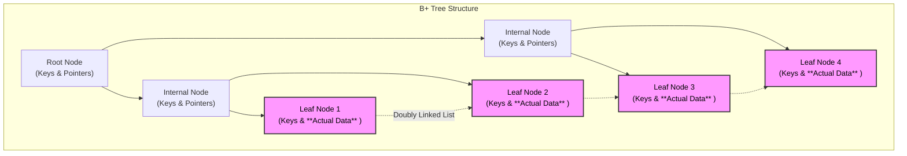
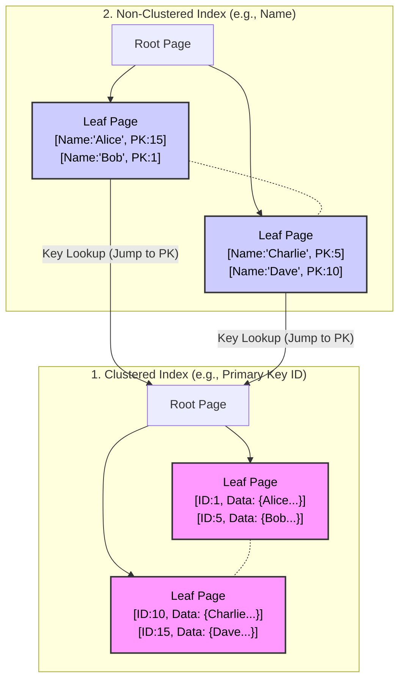

# Database Indexing: Internals & Architecture (Deep Dive)

## 1. The Core Data Structure: The B+ Tree
Most relational databases (MySQL/InnoDB, PostgreSQL) use **B+ Trees** (Balanced Trees), not Hash Maps or Binary Search Trees.

### Why B+ Tree?
* **Hash Map:** $O(1)$ lookup, but cannot handle **Range Queries** (`WHERE age > 18`).
* **Binary Tree:** Can become unbalanced (skewed), leading to $O(N)$ height.
* **B+ Tree:**
    * **Balanced:** All leaf nodes are at the same depth.
    * **Wide:** A single node has hundreds of children. This keeps the tree "short" (usually 3-4 levels deep even for millions of rows).
    * **Disk-Friendly:** Nodes map perfectly to Disk Pages (e.g., 16KB blocks).

### Internal Structure

1.  **Root Node:** The entry point.
2.  **Internal Nodes:** Signposts. They contain only **Keys** and pointers to child nodes. They do *not* contain data.
3.  **Leaf Nodes:** The destination.
    * They contain the **Actual Data** (or pointers to data).
    * **Critical Feature:** Leaf nodes are linked together in a **Doubly Linked List**. This allows for extremely fast sequential scanning (Range Scans).

---

## 2. Types of Indexes

### A. Clustered Index (The Physical Sort)
* **Definition:** The Clustered Index *is* the table. The data rows are physically stored on disk in the order of this index.
* **Constraint:** You can only have **ONE** Clustered Index per table (usually the Primary Key).
* **Analogy:** A **Phone Book**. The data (Phone Number) is sorted physically by the Key (Last Name). You don't need to jump to another page to find the number; it is right there.

### B. Non-Clustered (Secondary) Index
* **Definition:** A separate structure that stores the **Index Key** and a **Pointer** to the real row.
* **Constraint:** You can have multiple Secondary Indexes.
* **Analogy:** The **Index at the back of a Textbook**. It lists "Mitosis: Page 45". You find the keyword, then you have to "lookup" the actual content on Page 45.
* **Internal Detail:** In InnoDB (MySQL), the "Pointer" is actually the **Primary Key**.
    * *Flow:* Search Secondary Tree $\to$ Find PK ID $\to$ Search Clustered Tree (PK) $\to$ Get Row. This double-lookup is called a **Key Lookup**.

### Visual Comparison

---

## 3. The Mechanics: Read vs. Write

### The Read Path ($O(\log N)$)
Query: `SELECT * FROM Users WHERE ID = 500`
1.  Load Root Page.
2.  Is 500 < 300? Go Left. Is 500 > 300? Go Right.
3.  Traverse down 3 levels (Disk I/O).
4.  Hit Leaf Node. Read Data.

### The Write Path (The Performance Cost)
Query: `INSERT INTO Users (ID, Name) VALUES (500, 'Alice')`
Indexes slow down writes. Why?
1.  **Find Position:** DB must traverse the tree to find where `500` belongs to keep it sorted.
2.  **Page Split (Expensive):**
    * If the target Leaf Node (16KB page) is full, the DB must **Split** the page into two.
    * It promotes the middle key to the parent node.
    * If the parent is full, it splits the parent (cascading split).
    * *Result:* Massive Disk I/O and re-balancing overhead.

---

## 4. Advanced Concepts: Composite & Covering

### A. Composite Indexes (The "Left-Most Prefix" Rule)
If you create an index on `(Country, State, City)`:

* It acts as **3 indexes**:
    1.  `(Country)`
    2.  `(Country, State)`
    3.  `(Country, State, City)`
* **The Trap:** It does **NOT** work for searching by just `(State)` or `(City)`.
    * *Analogy:* If a phonebook is sorted by `Last Name, First Name`, you cannot easily find all people named "David" (First Name) without reading the whole book.

### B. Covering Index (The Ultimate Optimization)
Query: `SELECT Name FROM Users WHERE ID = 500`
* If you have a Non-Clustered Index on `(ID, Name)`:
    * The DB searches the Secondary Index.
    * It finds `500` and sees `Name` is sitting right there in the index node.
    * **Optimization:** It returns the result immediately **without** looking up the Clustered Index (No "Key Lookup").
    * *Impact:* Reduces I/O by 50%.

---

## 5. Senior Interview Q&A

### Q1: Why do we use B+ Trees instead of Binary Search Trees (BST)?
**Senior Answer:**
"Binary Trees grow 'tall' ($O(\log_2 N)$). For 1 Million rows, the height is ~20. That means 20 Disk Seeks, which is too slow.
B+ Trees are 'wide' ($O(\log_m N)$ where $m$ is branching factor ~1000). For 1 Million rows, the height is usually 2 or 3. This minimizes Disk I/O, which is the database bottleneck."

### Q2: Why is UUID bad as a Clustered Index (Primary Key)?
**Senior Answer:**
"A Clustered Index sorts data physically.
1.  **Randomness:** UUID v4 is random. Inserting a new UUID requires putting it in the *middle* of the B+ Tree.
2.  **Page Splitting:** This forces the DB to constantly load random pages from disk into memory and split them, causing 'Buffer Pool Thrashing.'
3.  **Fragmentation:** The disk pages end up 60-70% full, wasting storage.
    *Recommendation: Use TSID or UUID v7 (Time-Ordered) or Auto-Increment BigInt for Primary Keys.*"

### Q3: What is "Selectivity" and when does the DB ignore my index?
**Senior Answer:**
"Selectivity is the ratio of unique values to total rows.
* **High Selectivity:** Unique ID (Good for index).
* **Low Selectivity:** Gender (M/F) or 'IsActive' (True/False).
  If I query `WHERE IsActive = True` and 90% of users are active, the DB Optimizer will **ignore the index** and do a Full Table Scan. Why? Because random-access I/O to fetch 90% of rows via index is slower than just sequentially reading the whole table."

### Q4: Explain the difference between `DELETE` and `TRUNCATE` regarding indexes.
**Senior Answer:**
* **DELETE:** Scans the B+ Tree, finds rows, and marks them as 'deleted' one by one. It logs every deletion. This causes index fragmentation (holes in the tree).
* **TRUNCATE:** Drops the B+ Tree entirely and re-creates a fresh, empty root node. It is a DDL operation, instantaneous, and resets high-water marks."

### Q5: How does `LIKE 'ABC%'` differ from `LIKE '%ABC'`?
**Senior Answer:**
* `LIKE 'ABC%'`: Uses the index. It performs a Range Scan starting at 'ABC'.
* `LIKE '%ABC'`: **Cannot** use the index. Because the wildcard is at the start, the B+ Tree (which is sorted alphabetically) is useless. The DB must perform a Full Table Scan."