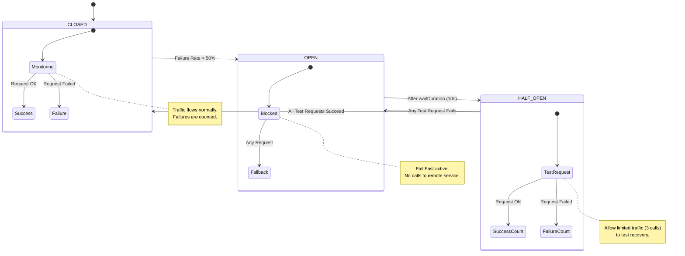

# Circuit Breaker Pattern Implementation (Java + Resilience4j)

This guide details how to implement the Circuit Breaker pattern in a Spring Boot application using **Resilience4j**. This pattern prevents cascading failures by stopping requests to a failing service immediately.

---

## 1. Dependencies
Add the following dependencies to your `pom.xml`.

```xml
<dependency>
    <groupId>io.github.resilience4j</groupId>
    <artifactId>resilience4j-spring-boot2</artifactId>
    <version>2.1.0</version>
</dependency>
<dependency>
    <groupId>org.springframework.boot</groupId>
    <artifactId>spring-boot-starter-aop</artifactId>
</dependency>
<dependency>
    <groupId>org.springframework.boot</groupId>
    <artifactId>spring-boot-starter-actuator</artifactId>
</dependency>
```

## 2. Configuration (`application.yml`)
Configure the sensitivity of the breaker. The goal is to fail fast when the error rate exceeds a specific threshold.

```yaml
resilience4j:
  circuitbreaker:
    instances:
      # Name of the specific backend service
      userServiceBreaker:
        # 1. State Management
        slidingWindowType: COUNT_BASED # Options: COUNT_BASED or TIME_BASED
        slidingWindowSize: 10          # Monitor the last 10 calls
        minimumNumberOfCalls: 5        # Wait for at least 5 calls before calculating failure rate
        
        # 2. Failure Thresholds
        failureRateThreshold: 50       # Open circuit if 50% of calls fail
        slowCallRateThreshold: 100     # Open circuit if 100% of calls are too slow
        slowCallDurationThreshold: 2s  # Calls taking longer than 2s are "slow"
        
        # 3. Recovery Strategy
        waitDurationInOpenState: 10s   # Stay OPEN for 10s before trying again
        permittedNumberOfCallsInHalfOpenState: 3 # Allow 3 test requests in HALF-OPEN
        
        # 4. Transitions
        automaticTransitionFromOpenToHalfOpenEnabled: true
```
## 3. Java Implementation

Use the `@CircuitBreaker` annotation on the service method that performs the remote call.

```java
import io.github.resilience4j.circuitbreaker.annotation.CircuitBreaker;
import org.springframework.stereotype.Service;
import org.springframework.web.client.RestTemplate;

@Service
public class UserService {

    private final RestTemplate restTemplate;

    public UserService(RestTemplate restTemplate) {
        this.restTemplate = restTemplate;
    }

    // "userServiceBreaker" must match the instance name in application.yml
    @CircuitBreaker(name = "userServiceBreaker", fallbackMethod = "fallbackGetUser")
    public String getUserProfile(String userId) {
        // Simulating a risky remote API call
        return restTemplate.getForObject("[https://remote-user-service.com/users/](https://remote-user-service.com/users/)" + userId, String.class);
    }

    // FALLBACK METHOD
    // Rule: Must have the same signature as the original method + Throwable parameter
    public String fallbackGetUser(String userId, Throwable t) {
        // 1. Log the error for debugging
        System.err.println("Alert: User Service is down. Reason: " + t.getMessage());
        
        // 2. Return a safe default or cached data to keep the UI working
        return "{\"id\": \"" + userId + "\", \"name\": \"Guest User (Cached)\"}";
    }
}
```

## 4. Internal State Machine (Visualized)

The Circuit Breaker transitions between three states based on the success/failure of requests.


## 5. How it works (Step-by-Step)

1.  **Normal Operation (CLOSED):** The first 5 requests (`minimumNumberOfCalls`) are allowed through.
2.  **Failure Detection:** If 3 out of those 5 requests throw an exception, the failure rate hits **60%**.
3.  **Circuit Opens:** Since 60% > 50% (`failureRateThreshold`), the state changes to **OPEN**.
4.  **Short Circuit:** The *next* request to `getUserProfile` is intercepted. The `restTemplate` is **not** called. Resilience4j immediately throws a `CallNotPermittedException`.
5.  **Fallback:** The `fallbackGetUser` method catches the exception and returns the "Guest User" JSON.
6.  **Recovery Attempt:** After 10 seconds (`waitDurationInOpenState`), the state flips to **HALF-OPEN**.
7.  **Testing:** The next 3 requests are allowed through to the real service.
    * **Success:** State resets to **CLOSED**.
    * **Failure:** State goes back to **OPEN** and the timer resets.
