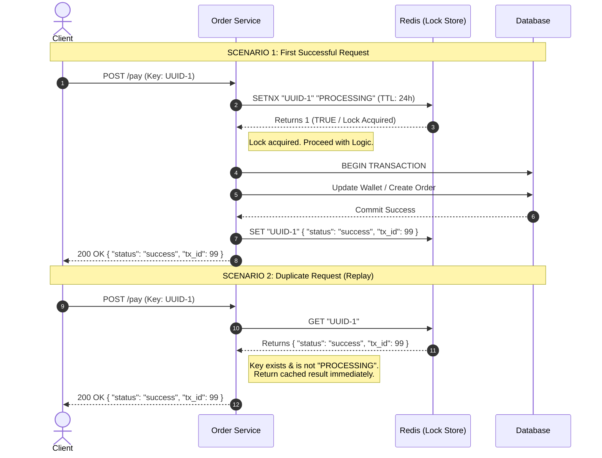
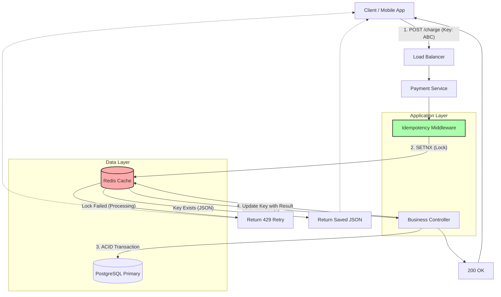

# Idempotency: HLD & Sequence Diagrams (Visual Guide)

## 1. The Prevention Logic (Atomic State Machine)
We prevent duplicates by treating every request ID as a state machine with three states:
1.  **Null (New):** The ID has never been seen. $\to$ **Action:** Lock and Proceed.
2.  **Processing:** The ID is currently being worked on by another thread. $\to$ **Action:** Return 429/Wait.
3.  **Completed:** The ID has a finished response saved. $\to$ **Action:** Return Saved Response.

---

## 2. UML Sequence Diagram (The Request Flow)
This diagram illustrates the timeline comparison between a **New Request** and a **Duplicate Request**.


The sequence diagram splits the flow into two distinct scenarios: **The Happy Path** and the **Replay Path**.
### Scenario 1: The First Successful Request (Steps 1-4)
* **Step 1 (Atomic Lock):** The API calls `SETNX` (Set if Not Exists) to Redis.
    * *Visual:* `API -> Redis: SETNX "UUID-1" "PROCESSING"`
    * *Logic:* This is the critical gate. If Redis returns `1` (True), we own the lock. We set a 24h TTL (Time-To-Live) here to prevent deadlocks if the server crashes.
* **Step 2 (Business Logic):** The API executes the actual transaction in the Database.
    * *Visual:* `API -> DB: BEGIN TRANSACTION ... COMMIT`
    * *Logic:* This is the "Point of No Return." Once the DB commits, the money is moved.
* **Step 3 (Update State):** We overwrite the Redis key.
    * *Visual:* `API -> Redis: SET "UUID-1" { ...JSON... }`
    * *Logic:* We replace the placeholder string `"PROCESSING"` with the actual final result.
* **Step 4 (Response):** The client gets the 200 OK.

### Scenario 2: The Duplicate / Replay Request
* **The Trigger:** The client sends the exact same `Key: UUID-1`.
* **The Check:** The API queries Redis (`GET`).
* **The Result:** Redis returns the JSON object saved in Step 3.
* **The Action:** The API sees the data is already there. It **skips** the Database entirely and returns the JSON immediately.

---

## 3. High-Level Design (HLD) Architecture
This diagram shows where the Idempotency Middleware sits in the system to protect the database.


The Flowchart shows how the **Idempotency Middleware** acts as a shield for the Database.

* **Load Balancer (LB):** Distributes traffic. It does *not* handle idempotency; it simply passes the `Idempotency-Key` header through.
* **Idempotency Middleware (The Shield):**
    * This component sits *before* the Controller.
    * It communicates **only** with Redis initially. It does not touch the SQL DB yet.
    * This ensures that high-volume duplicate spam (e.g., a button mashing user) is rejected at the cache layer (sub-millisecond latency) without bogging down the expensive SQL connections.
* **Redis (The State Store):**
    * Acts as the "Lock Manager." It holds the temporary state.
* **PostgreSQL (The Truth):**
    * Only receives traffic if the Middleware allows it.
    * **Safety Net:** The DB also has a `UNIQUE(idempotency_key)` constraint. If Redis fails (e.g., flush/crash) and lets a duplicate through, the DB acts as the final hard barrier and rejects the insert.

---

## 4. Senior Engineer Q&A: "The Edge Case"

**The Question:**
"In the diagrams above, what happens if the **Database Commit succeeds**, but the **Redis Update (Step 3 in Sequence) fails** (e.g., Redis network blip)?"

**The Answer:**
1.  **The State:** The User was charged (DB has data), but Redis still says "PROCESSING" (or the key expires).
2.  **The Retry:** The user retries. Redis allows the request through (because lock expired or is missing).
3.  **The Safety Net:** The **Database** must have a unique constraint on `(idempotency_key, user_id)`.
    * When the "Second" request hits the DB, the DB throws a `UniqueConstraintViolation` exception.
    * The API catches this exception, queries the order by the Key, and repairs the Redis state/returns the success response.
    * *Takeaway: Redis is for speed; The Database is for final consistency.*
4.  **What if Step 3 (Redis Update) fails?** If the DB commits, but the Redis update fails, the key remains stuck in `"PROCESSING"` (or expires).
     * **Correction:** When the user retries, the system might try to process it again.
     * **Defense:** The **Database Unique Constraint** will catch this second attempt. The code catch block must handle `UniqueViolationException`, fetch the existing order from the DB, repair the Redis cache, and return success.

# Detailed Explanation: Idempotency Design & Logic

## 1. The Logic Flow: A State Machine Approach
To understand the Sequence Diagram, we must view the Idempotency Key not just as a string, but as a pointer to a **State Machine** managed in Redis.

### The Three States
1.  **NULL (New Request):** The key does not exist in Redis.
    * *Meaning:* This is the first time we are seeing this request.
    * *Action:* Acquire Lock $\to$ Process.
2.  **PROCESSING (In-Flight):** The key exists, but the value is a placeholder string `"PROCESSING"`.
    * *Meaning:* Another thread/server is currently running the logic for this key.
    * *Action:* Block execution $\to$ Return `429 Too Many Requests` or `202 Accepted`.
3.  **COMPLETED (Cached):** The key exists, and the value is the final **JSON Response**.
    * *Meaning:* The work is already finished.
    * *Action:* Return the stored JSON immediately (Short-circuit).

---

## 2. Walkthrough of the Sequence Diagram

### Scenario A: The Happy Path (First Request)
1.  **Atomic Locking (`SETNX`):**
    * When the request hits the API, we use the Redis command `SETNX key "PROCESSING"`.
    * **Why `SETNX`?** It stands for "SET if Not Exists". It is atomic. If two users send the same key at the exact same microsecond, Redis guarantees only **one** will get a return value of `1` (True). The other gets `0` (False).
    * **TTL (Time-To-Live):** We *always* attach an expiration (e.g., 24 hours). If the server crashes while processing, the key must eventually expire so the user can retry.
2.  **Business Logic (ACID):**
    * Once the lock is acquired, we perform the actual database operations (e.g., debit wallet, create order).
    * This happens inside a Database Transaction (`BEGIN` ... `COMMIT`).
3.  **State Update:**
    * After the DB commit is successful, we update the Redis key.
    * We replace `"PROCESSING"` with the actual result: `{"status": "success", "order_id": 123}`.

### Scenario B: The Duplicate / Replay
1.  **The Check:**
    * The client retries the request (due to a network timeout previously).
    * The Middleware checks Redis.
2.  **The Short-Circuit:**
    * It sees the key exists and contains the JSON payload.
    * It bypasses the Payment Service entirely.
    * It returns the saved response.
    * **Benefit:** Zero load on the Database; safer for the user (no double charge).

---

## 3. High Level Design (HLD) Components

### The Idempotency Middleware (The Gatekeeper)
Instead of writing this logic inside every Controller (Order Controller, Refund Controller), we implement it as **Middleware** or an **Interceptor**.
* **Responsibility:** It intercepts the HTTP request *before* it reaches the business logic.
* **Scalability:** Because it runs on the application layer, it scales horizontally with your API instances.

### Redis (The Hot Store)
We choose Redis over a Database for the locking mechanism because:
* **Speed:** Redis operates in memory (sub-millisecond latency). Adding 50ms to every API call for a DB lock is too slow.
* **Atomic Primitives:** Redis supports scripts (Lua) and atomic commands needed for the locking pattern.

### The Database (The Source of Truth)
While Redis handles the "Fast Path," the Database is the ultimate safety net.
* **The Constraint:** The table storing the orders/transactions should have a unique constraint:
    ```sql
    UNIQUE INDEX idx_idempotency (user_id, idempotency_key);
    ```
* **Why?** If Redis flushes its cache or crashes, and a duplicate request gets through to the DB, this SQL constraint will throw an error, preventing data corruption.

---

## 4. Handling Failures (The "Edge Cases")

### Failure Scenario 1: Process Crashes mid-execution
* *Event:* Server acquires lock ("PROCESSING"), then crashes before updating Redis or DB.
* *Result:* Redis is stuck in "PROCESSING".
* *Recovery:* The **TTL** (e.g., 30 seconds or 24 hours) kicks in. The key expires. The user retries, and it is treated as a new request.

### Failure Scenario 2: DB Commit Success, Redis Update Fails
* *Event:* We charged the user (DB Commit), but the network call to update Redis with the JSON response failed.
* *Result:* DB has the order, but Redis still says "PROCESSING" (or expires).
* *Recovery:*
    1.  User retries.
    2.  Redis lock is acquired (since old one expired).
    3.  Request hits Database.
    4.  **Database throws Unique Constraint Violation.**
    5.  Application catches this specific exception.
    6.  Application queries the DB: `SELECT * FROM orders WHERE key = ...`
    7.  Application reconstructs the response, updates Redis, and returns success.