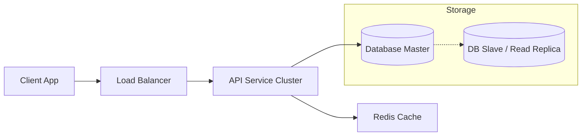

# System Design Interview Framework
### A 5-Step Guide to Acing the Design Round

System design interviews are unstructured by nature. Their goal is not just to see the "correct" architecture, but to evaluate how you handle ambiguity, trade-offs, and communication.

The best approach is to follow a strict **framework**. This prevents you from getting lost and ensures you cover all critical aspects.

---

## Step 1: Requirement Clarification (5-10 mins)
**"Measure twice, cut once."**
Never start drawing boxes immediately. The interviewer gives you a vague prompt (e.g., "Design Twitter"). Your job is to scope it down.

### Functional Requirements (The "What")
What can the user *do*? Limit this to the top 3-4 most critical features.
* *Example:* Users can post tweets? Follow others? View a home timeline?
* *Anti-Pattern:* Do not try to design the whole app (e.g., "Reset Password" or "Edit Profile" flows are usually irrelevant).

### Non-Functional Requirements (The "How")
What are the system constraints?
* **Scalability:** How many users? (1 Million or 1 Billion?)
* **Latency:** Is it real-time (Chat) or is delay okay (Email/Notifications)?
* **Consistency vs. Availability (CAP Theorem):**
    * *Eventual Consistency:* Is it okay if I see a tweet 5 seconds after it's posted? (Usually Yes).
    * *Strong Consistency:* Is it okay if a payment transaction is delayed but accurate? (Usually Yes).

> **Pro Tip:** Write these requirements on the whiteboard or shared doc. They serve as your "contract" for the rest of the interview.

---

## Step 2: Back-of-the-Envelope Estimation (5 mins)
Do some quick math to decide if you need complex scaling solutions (sharding, caching) or if a simple database works. You don't need exact numbers, just the "Scale".

### Example: Twitter Scale
* **Traffic:** 10M Daily Active Users (DAU) $\times$ 5 tweets/day = 50M tweets/day.
    * $50,000,000 / 86,400 \approx 600$ writes per second (TPS).
    * *Conclusion:* Write load is low. A single DB master might handle writes, but we likely need to optimize for **Reads** (Read-Heavy system).
* **Storage:** 50M tweets $\times$ 100 bytes = 5GB / day.
    * 5GB $\times$ 365 days $\approx$ 2TB / year.
    * *Conclusion:* 2TB is manageable, but over 5 years (10TB) we will definitely need **Sharding** or a Distributed Database.

---

## Step 3: High-Level Design (10-15 mins)
Draw the "30,000-foot view." Do not get into the weeds of database columns yet. Draw the flow of data.

**Standard Architecture:**

### Key Decision Points
* **Database Choice:** "I'm thinking of using a NoSQL DB (like Cassandra or DynamoDB) for storing tweets because we need high write throughput and flexible schema, OR a SQL DB (Postgres) because the relationship data is complex."
* **Separation of Concerns:** "I will separate the *Read Service* (viewing feeds) from the *Write Service* (posting tweets) because the scaling requirements are different."

---

## Step 4: Deep Dive & Detailed Design (15-20 mins)
The interviewer will likely point to one component and say, "Let's dig into that." If they don't, you should drive it.

### 1. API Design
Define the contract between Client and Server.
* `POST /v1/tweet`
    * Params: `user_id`, `content`, `media_url`
* `GET /v1/feed`
    * Params: `user_id`, `page_token` (for pagination)

### 2. Database Schema
Define tables or collections.
* **User Table:** `id (PK), username, email, password_hash`
* **Tweet Table:** `id (PK), user_id (FK), content, created_at`
* **Follow Table:** `follower_id, followee_id` (Composite Key)

### 3. Critical Algorithms
* *Feed Generation:* "How do we efficiently merge tweets from 500 people I follow?"
    * **Pull Model (Fan-out on Load):** Query all 500 people's tweets when I open the app. (Slow reads, fast writes).
    * **Push Model (Fan-out on Write):** When I tweet, push that ID to all my followers' pre-computed feed lists. (Fast reads, slow writes).

---

## Step 5: Bottlenecks & Wrap-up (5 mins)
Look at your design critically. Identify where it will break.

* **Single Points of Failure (SPOF):** "If the Load Balancer dies, the whole site goes down. We need a standby LB with Heartbeat monitoring."
* **Hotspots:** "If a celebrity tweets, millions of people read it at once. We need a dedicated Cache strategy for celebrity tweets."
* **Monitoring:** "We need metrics (Latency, Error Rate) and Alarms to know if the system is healthy."

---

## Summary Checklist

| Phase | Goal | Key Phrase to Use |
| :--- | :--- | :--- |
| **1. Requirements** | Limit scope | "Before we start, can I clarify the exact scope?" |
| **2. Estimations** | Determine scale | "Let me do some quick math on storage needs." |
| **3. High-Level** | Block diagram | "Here is the basic data flow..." |
| **4. Deep Dive** | Specifics | "Let's zoom into the Database schema." |
| **5. Bottlenecks** | Self-critique | "One issue with this design is..." |