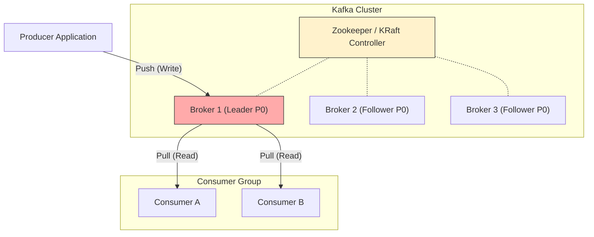
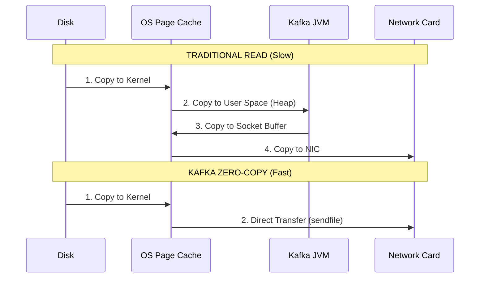

# Apache Kafka: Components, Internals & Architecture (Deep Dive)

## 1. High-Level Architecture
Kafka is a distributed event streaming platform. Unlike traditional Message Queues (RabbitMQ) which are "Smart Broker, Dumb Client," Kafka is **"Dumb Broker, Smart Client."** It functions as a **Distributed Commit Log**.

### The Core Components
1.  **Broker:** A single Kafka server. It receives messages, stores them on disk, and serves fetch requests.
2.  **Topic:** A logical category name to which messages are published (e.g., `user_logs`).
3.  **Partition:** The unit of parallelism. A topic is split into multiple partitions distributed across brokers.
4.  **Producer:** Applications that publish (write) data.
5.  **Consumer:** Applications that subscribe to (read) data.
6.  **Zookeeper / KRaft:** The brain of the cluster. It manages metadata (Broker IDs, Topic configs, Leader election). *Note: Newer Kafka uses KRaft (Raft protocol) to remove the Zookeeper dependency.*

### Visual Architecture

---

## 2. Data Structure Deep Dive: Topics, Partitions & Segments
This is where Kafka differs from a database.

### A. The Partition (The Physical Log)
A Topic is just a logical grouping. The **Partition** is the physical append-only log.
* **Offset:** Every message in a partition gets a unique, incremental ID called an **Offset**.
* **Immutability:** Once written, a message cannot be modified. It can only be deleted via "Retention Policy" (e.g., delete after 7 days).
* **Ordering:** Guaranteed **only within a partition**, not across the entire topic.

### B. The Segment (Files on Disk)
You cannot store an infinite log in one file. Kafka splits partitions into **Segments** (default 1GB).
* **`.log` file:** The actual message data.
* **`.index` file:** Maps Offset $\to$ Physical Byte Position (for fast lookups).
* **`.timeindex` file:** Maps Timestamp $\to$ Offset.

**How Lookups Work:**
To find Offset 5000:
1.  Kafka finds the **Segment** file that contains offset 5000.
2.  It checks the **Index** file using Binary Search ($O(\log N)$) to find the nearest physical position.
3.  It scans the `.log` file from that position.

---

## 3. The Internal Working: Why is Kafka so fast?
Kafka can handle millions of messages/sec on spinning hard disks.

### 1. Sequential I/O (The Disk Trick)
* **Random Access (DBs):** Jumping around the disk (Seek Time) is slow.
* **Sequential Access (Kafka):** Writing to the end of a file (Append) is incredibly fast. Kafka **always** appends; it never seeks/modifies old data.

### 2. Zero-Copy Principle (The Network Trick)
Standard data transfer involves 4 copies: `Disk -> OS Cache -> App Memory -> Socket Buffer -> NIC`.
Kafka uses the Linux `sendfile()` system call to bypass the Application Memory (JVM).

**The Zero-Copy Path:**
`Disk -> OS Page Cache -> Network Interface Card (NIC)`

### 3. Page Cache
Kafka does not cache messages in the Java Heap (GC overhead). It relies on the **OS Page Cache**. The OS uses all free RAM to cache disk pages. If you restart the Kafka Broker process, the "hot" data remains in the OS RAM.

---

## 4. Workflows: Write & Read

### A. The Producer (Write Path)
1.  **Partitioning:** The producer determines the partition:
    * `hash(key) % num_partitions` (if Key exists).
    * `Round Robin` (if Key is null).
2.  **Accumulator:** Messages are not sent immediately. They are grouped into **Batches** in a memory buffer to reduce network IOPS.
3.  **Transmission:** A sender thread picks up the batch and sends it to the **Leader Broker**.

### B. The Consumer (Read Path)
1.  **Consumer Group:** A logical grouping of consumers.
    * **Rule:** A partition can be read by **only one** consumer in a group.
    * **Scenario:** If you have 4 partitions and 5 consumers, 1 consumer will be **Idle**.
2.  **Pull Model:** The consumer requests data: `poll(timeout)`.
3.  **Offset Commit:** After processing, the consumer sends a message to a special topic `__consumer_offsets` to save its progress.

---

## 5. Reliability & Replication Internals
Kafka guarantees no data loss via replication.

### Leader & Followers
* **Leader:** Handles ALL Reads and Writes for a partition.
* **Follower:** Passively fetches data from the Leader (like a consumer).

### ISR (In-Sync Replica)
* **ISR List:** A list of replicas that are "caught up" with the Leader.
* **High Water Mark (HW):** The offset of the last message that has been successfully replicated to **all** ISRs.
* **Consistency:** Consumers can only read up to the High Water Mark. This prevents "Ghost Reads" (seeing data that might be lost if the leader crashes).

---

## 6. Senior Interview Q&A

### Q1: "How does Kafka handle 'Split Brain' (Controller issues)?"
**Senior Answer:**
"In the old Zookeeper model, Split Brain could happen if ZK sessions timed out. Modern Kafka uses **Epoch Numbers** (Generation IDs). Every time a new Controller/Leader is elected, the Epoch increments. If a 'Zombie Leader' tries to write to the log, other brokers reject it because its Epoch is old."

### Q2: "What happens if I add a new Consumer to a running Group?"
**Senior Answer:**
"This triggers a **Rebalance**.
1.  The Group Coordinator (a Broker) pauses all consumers in that group.
2.  Ownership of partitions is recalculated.
3.  Partitions are reassigned to include the new consumer.
4.  *Impact:* This causes a brief 'Stop-the-World' latency spike (Consumer Lag). Newer 'Cooperative Rebalancing' strategies minimize this."

### Q3: "What is 'Log Compaction'?"
**Senior Answer:**
"Standard Kafka retention deletes data by time (e.g., 7 days). **Log Compaction** retains the **latest value** for every unique Key, indefinitely.
* *Use Case:* Restoring state tables (e.g., 'Current Address of User'). We don't care about their 50 previous addresses, only the last one."

### Q4: "How do you achieve Exactly-Once Semantics (EOS)?"
**Senior Answer:**
"We combine two features:
1.  **Idempotent Producer:** `enable.idempotence=true`. The broker assigns a Sequence Number to deduplicate retries network-side.
2.  **Transactional API:** When writing to multiple partitions (or Consume-Process-Produce loops), we use `beginTransaction` / `commitTransaction` to ensure atomic writes."