# Application-Level Reverse Proxy (Python & Java)

This repository contains reference implementations for a manual **Application-Level Reverse Proxy** (often called a Gateway).

Unlike infrastructure proxies (Nginx, HAProxy), these implementations run as application code, allowing you to inject custom logic (authentication, logging, header manipulation) before forwarding requests to upstream services.

## 📋 Table of Contents
- [Architecture](#-architecture)
- [Prerequisites](#-prerequisites)
- [Option 1: Python (Flask)](#-option-1-python-flask)
- [Option 2: Java (Spring Boot)](#-option-2-java-spring-boot)
- [Testing](#-testing)

---

## 🏗 Architecture

The proxy sits between the Client and the Destination Service. It intercepts the request, modifies headers (e.g., adding secrets, stripping hop-by-hop headers), and forwards the traffic.


---

## 🛠 Prerequisites

* **Python:** Python 3.8+
* **Java:** JDK 17+ and Maven
* **Target Service:** This example uses `https://jsonplaceholder.typicode.com` as the dummy backend.

---

## 🐍 Option 1: Python (Flask)

Ideal for lightweight gateways, data science wrappers, or rapid prototyping.

### 1. Setup
Install the required packages:
```bash
pip install flask requests
```

### 2. Implementation (`proxy.py`)

```python
import requests
from flask import Flask, request, Response

app = Flask(__name__)

# Configuration
TARGET_SERVICE = '[https://jsonplaceholder.typicode.com](https://jsonplaceholder.typicode.com)'
PORT = 5000

# Catch-all route to handle any path
@app.route('/', defaults={'path': ''})
@app.route('/<path:path>', methods=['GET', 'POST', 'PUT', 'DELETE', 'PATCH'])
def reverse_proxy(path):
    # 1. Construct the Destination URL
    target_url = f"{TARGET_SERVICE}/{path}"

    # 2. Filter Headers
    # We strip 'Host' to avoid 404s from cloud providers checking domain names
    headers = {key: value for key, value in request.headers if key != 'Host'}
    
    # Inject Custom Secret
    headers['X-Internal-Secret'] = 'my-super-secure-key'

    try:
        # 3. Forward the Request
        resp = requests.request(
            method=request.method,
            url=target_url,
            headers=headers,
            data=request.get_data(),
            cookies=request.cookies,
            params=request.args,
            allow_redirects=False
        )

        # 4. Filter Response Headers
        # Strip hop-by-hop headers that can break the proxy connection
        excluded_headers = ['content-encoding', 'content-length', 'transfer-encoding', 'connection']
        headers = [
            (k, v) for k, v in resp.raw.headers.items()
            if k.lower() not in excluded_headers
        ]

        return Response(resp.content, resp.status_code, headers)

    except requests.exceptions.RequestException as e:
        return Response(f"Proxy Error: {str(e)}", 502)

if __name__ == '__main__':
    print(f"🚀 Python Proxy running on http://localhost:{PORT}")
    app.run(host='0.0.0.0', port=PORT, debug=True)
```

### 3. Run
```bash
python proxy.py
```

---

## ☕ Option 2: Java (Spring Boot)

Ideal for enterprise environments requiring strong typing, high concurrency, or integration with Spring Security.

### 1. Dependencies (`pom.xml`)
Ensure you have `spring-boot-starter-web`.

```xml
<dependency>
    <groupId>org.springframework.boot</groupId>
    <artifactId>spring-boot-starter-web</artifactId>
</dependency>
```

### 2. Implementation (`ProxyController.java`)

```java
package com.example.proxy;

import org.springframework.http.*;
import org.springframework.web.bind.annotation.*;
import org.springframework.web.client.RestTemplate;
import org.springframework.web.util.UriComponentsBuilder;

import javax.servlet.http.HttpServletRequest;
import java.net.URI;
import java.util.Enumeration;

@RestController
public class ProxyController {

    private final String TARGET_SERVICE = "[https://jsonplaceholder.typicode.com](https://jsonplaceholder.typicode.com)";
    private final RestTemplate restTemplate = new RestTemplate();

    // Catch-all mapping for all HTTP methods
    @RequestMapping("/**")
    public ResponseEntity<byte[]> proxyRequest(
            @RequestBody(required = false) byte[] body,
            HttpMethod method,
            HttpServletRequest request,
            @RequestHeader HttpHeaders originalHeaders
    ) {
        try {
            // 1. Construct Destination URI
            // getRequestURI includes the full path (e.g., /todos/1)
            URI uri = UriComponentsBuilder
                    .fromHttpUrl(TARGET_SERVICE + request.getRequestURI())
                    .query(request.getQueryString())
                    .build(true)
                    .toUri();

            // 2. Prepare Headers
            HttpHeaders headers = new HttpHeaders();
            headers.addAll(originalHeaders);
            
            // Remove Host header to prevent domain mismatch at target
            headers.remove(HttpHeaders.HOST);
            
            // Inject Custom Logic
            headers.set("X-Gateway-Auth", "Internal-Secret-Key");

            // 3. Forward Request
            HttpEntity<byte[]> httpEntity = new HttpEntity<>(body, headers);
            
            ResponseEntity<byte[]> response = restTemplate.exchange(
                    uri, 
                    method, 
                    httpEntity, 
                    byte[].class
            );

            return response;

        } catch (Exception e) {
            return ResponseEntity
                    .status(HttpStatus.BAD_GATEWAY)
                    .body(("Proxy Error: " + e.getMessage()).getBytes());
        }
    }
}
```

### 3. Run
```bash
mvn spring-boot:run
```

---

## 🧪 Testing

Once your proxy (Python or Java) is running, you can test it using `curl`.

**Fetch a Todo Item:**
```bash
# Requests to localhost:5000 (Python) or localhost:8080 (Java)
# will be forwarded to jsonplaceholder.typicode.com
curl -v http://localhost:5000/todos/1
```

**Expected Output:**
```json
{
  "userId": 1,
  "id": 1,
  "title": "delectus aut autem",
  "completed": false
}
```

---

## 🌐 Infrastructure Implementations

While Application-Level proxies (Python/Java) are great for logic, **Infrastructure-Level** proxies are best for high performance, SSL termination, and traffic shaping.

### Option 3: Nginx (Load Balancer)

Nginx is the industry standard for high-performance reverse proxying. It is written in C and handles concurrency much better than Python or Java.

#### A. Nginx as a Reverse Proxy (Standard)
*Use this to protect your backend services.*

**File:** `nginx-reverse.conf`

```nginx
events {}

http {
    # Define a group of servers (Load Balancing)
    upstream my_backend_app {
        server localhost:5000; # Python App
        server localhost:8080; # Java App
    }

    server {
        listen 80;
        server_name my-app.com;

        location / {
            # 1. Forward traffic to the upstream group
            proxy_pass http://my_backend_app;

            # 2. Standard Headers for Reverse Proxying
            proxy_set_header Host $host;
            proxy_set_header X-Real-IP $remote_addr;
            proxy_set_header X-Forwarded-For $proxy_add_x_forwarded_for;

            # 3. Timeouts (Prevent hanging connections)
            proxy_connect_timeout 5s;
            proxy_read_timeout 10s;
        }
    }
}
```

#### B. Nginx as a Forward Proxy (Tunnel)
*Use this if you need a proxy for your internal servers to access the internet securely.*

**File:** `nginx-forward.conf`

```nginx
events {}

http {
    server {
        # Clients configure this port (8888) in their browser/OS proxy settings
        listen 8888;

        location / {
            # 1. DNS Resolver is required to look up target domains
            resolver 8.8.8.8;

            # 2. Forward to the host requested by the client
            proxy_pass http://$http_host$request_uri;
            
            # Optional: Hide the identity of the client
            proxy_hide_header X-Forwarded-For;
        }
    }
}
```

---

### Option 4: AWS API Gateway (Terraform)

For cloud-native applications, you should use a managed API Gateway instead of managing servers. This Terraform configuration creates a **Reverse Proxy** that sits in front of your service.

**File:** `main.tf`

```hcl
provider "aws" {
  region = "us-east-1"
}

# 1. Create the Gateway
resource "aws_api_gateway_rest_api" "MyGateway" {
  name        = "MyProjectGateway"
  description = "Reverse Proxy for my internal microservices"
}

# 2. Create a Resource (e.g., /status)
resource "aws_api_gateway_resource" "StatusResource" {
  rest_api_id = aws_api_gateway_rest_api.MyGateway.id
  parent_id   = aws_api_gateway_rest_api.MyGateway.root_resource_id
  path_part   = "status"
}

# 3. Define Method (GET)
resource "aws_api_gateway_method" "StatusMethod" {
  rest_api_id   = aws_api_gateway_rest_api.MyGateway.id
  resource_id   = aws_api_gateway_resource.StatusResource.id
  http_method   = "GET"
  authorization = "NONE"
}

# 4. The Reverse Proxy Logic (Integration)
resource "aws_api_gateway_integration" "ProxyIntegration" {
  rest_api_id             = aws_api_gateway_rest_api.MyGateway.id
  resource_id             = aws_api_gateway_resource.StatusResource.id
  http_method             = aws_api_gateway_method.StatusMethod.http_method
  
  # HTTP_PROXY type acts as a simple pass-through
  type                    = "HTTP_PROXY"
  integration_http_method = "GET"
  
  # Target URL (Where the request actually goes)
  uri                     = "[http://my-backend-service.com/status](http://my-backend-service.com/status)"
}

# 5. Deploy
resource "aws_api_gateway_deployment" "MyDeployment" {
  depends_on  = [aws_api_gateway_integration.ProxyIntegration]
  rest_api_id = aws_api_gateway_rest_api.MyGateway.id
  stage_name  = "prod"
}
```

# Securing the Proxy Chain: preventing Direct Access

A common security vulnerability in Proxy/Gateway architectures is **Bypass Attacks**. If a user discovers the IP address of your backend service, they might try to send requests directly to it, bypassing the authentication, logging, or rate-limiting logic inside your Proxy.

This guide details four strategies to ensure **every** request must pass through your Proxy.

## 📋 Strategy Overview

| Strategy | Implementation Level | Security Level | Best For... |
| :--- | :--- | :--- | :--- |
| **1. Secret Handshake** | Code (App Level) | ⭐⭐ | Quick fixes, legacy apps without firewalls. |
| **2. Localhost Binding** | Network Config | ⭐⭐⭐ | Monolithic servers (Proxy & App on same machine). |
| **3. Docker Networking** | Infrastructure | ⭐⭐⭐⭐⭐ | Containerized environments (Standard). |
| **4. IP Whitelisting** | Firewall/Cloud | ⭐⭐⭐⭐⭐ | Distributed systems (AWS, separate VMs). |

---

## 🔐 Strategy 1: The "Secret Handshake" (Application Level)

The Proxy injects a secret header (e.g., `X-Internal-Secret`) into the request. The Target Service checks for this header and rejects any request that doesn't have it.

### 🐍 Python (Flask) Target Implementation
*Modify your Backend Service to check for the header.*

```python
from flask import Flask, request, abort

app = Flask(__name__)

# This must match the key used in your Proxy
PROXY_SECRET = "my-super-secure-key"

@app.before_request
def restrict_direct_access():
    """
    Middleware that runs before every request.
    If the secret header is missing or wrong, return 403 Forbidden.
    """
    client_secret = request.headers.get('X-Internal-Secret')
    
    if client_secret != PROXY_SECRET:
        abort(403, description="⛔ Access Denied: You must use the Proxy.")

@app.route('/data')
def get_data():
    return "✅ You are authorized!"

if __name__ == '__main__':
    app.run(port=8080)
```

### ☕ Java (Spring Boot) Target Implementation
*Add a Security Filter to intercept requests before they reach the Controller.*

```java
import org.springframework.stereotype.Component;
import javax.servlet.*;
import javax.servlet.http.HttpServletRequest;
import javax.servlet.http.HttpServletResponse;
import java.io.IOException;

@Component
public class ProxySecurityFilter implements Filter {

    private final String PROXY_SECRET = "my-super-secure-key";

    @Override
    public void doFilter(ServletRequest request, ServletResponse response, FilterChain chain)
            throws IOException, ServletException {
        
        HttpServletRequest req = (HttpServletRequest) request;
        HttpServletResponse res = (HttpServletResponse) response;

        // Check for the header injected by the Proxy
        String clientSecret = req.getHeader("X-Gateway-Auth");

        if (PROXY_SECRET.equals(clientSecret)) {
            // ✅ Authorized: Continue to controller
            chain.doFilter(request, response);
        } else {
            // ⛔ Unauthorized: Block request
            res.sendError(HttpServletResponse.SC_FORBIDDEN, "Access Denied: Direct Access Prohibited");
        }
    }
}
```

---

## 🐳 Strategy 2: Docker Internal Networks

If you use Docker, this is the cleanest solution. You create a private network that isn't exposed to the host machine.

**Concept:**
* **Proxy Container:** Ports mapped to Host (Public).
* **Target Container:** NO ports mapped to Host (Private).

```yaml
version: '3'
services:
  # 1. The Proxy (Publicly Accessible)
  my-proxy:
    image: my-python-proxy
    ports:
      - "80:5000" # Maps Host Port 80 -> Container Port 5000
    networks:
      - internal-net

  # 2. The Target Service (Hidden)
  my-target:
    image: my-java-service
    # ⛔ CRITICAL: Do NOT add a 'ports' section here.
    # This ensures port 8080 is unreachable from the internet.
    networks:
      - internal-net

networks:
  internal-net:
    driver: bridge
```

---

## 🧱 Strategy 3: Firewall / Security Groups

If your services run on different servers (e.g., AWS EC2, DigitalOcean Droplets), use network firewalls.

### Logical Flow

```mermaid
graph LR
    User((User)) -- "1. Request" --> Proxy[Proxy Server]
    Proxy -- "2. Forward (Allowed)" --> Firewall{Firewall}
    User -- "3. Direct Attempt (Blocked)" --> Firewall
    
    subgraph Target Server
        Firewall -- "Allow IP: 10.0.0.5" --> App[Backend App]
        Firewall -- "Deny All Others" --> Drop[🗑️ Drop Packet]
    end
    
    style Drop fill:#f96,stroke:#333,stroke-width:2px
    style Firewall fill:#bbf,stroke:#333,stroke-width:2px
```



### Configuration Example (AWS Security Groups)

1.  **Security Group A (Attached to Proxy):**
    * **Inbound:** Allow port `80/443` from `0.0.0.0/0` (Anywhere).
    * **Outbound:** Allow All.

2.  **Security Group B (Attached to Backend):**
    * **Inbound:** Allow port `8080` **ONLY** from `Source: Security Group A`.
    * **Inbound:** Deny All from `0.0.0.0/0`.

---

## 🏠 Strategy 4: Localhost Binding

If both the Proxy and the App run on the **same physical server**, you can bind the backend app to `localhost` (127.0.0.1).

* **Public IP (0.0.0.0):** Accessible by the internet.
* **Loopback IP (127.0.0.1):** Accessible ONLY by processes on the same machine.

**Python Configuration:**
```python
# Only the local proxy can see this
app.run(host='127.0.0.1', port=8080)
```

**Java Configuration (`application.properties`):**
```properties
server.address=127.0.0.1
server.port=8080
```

