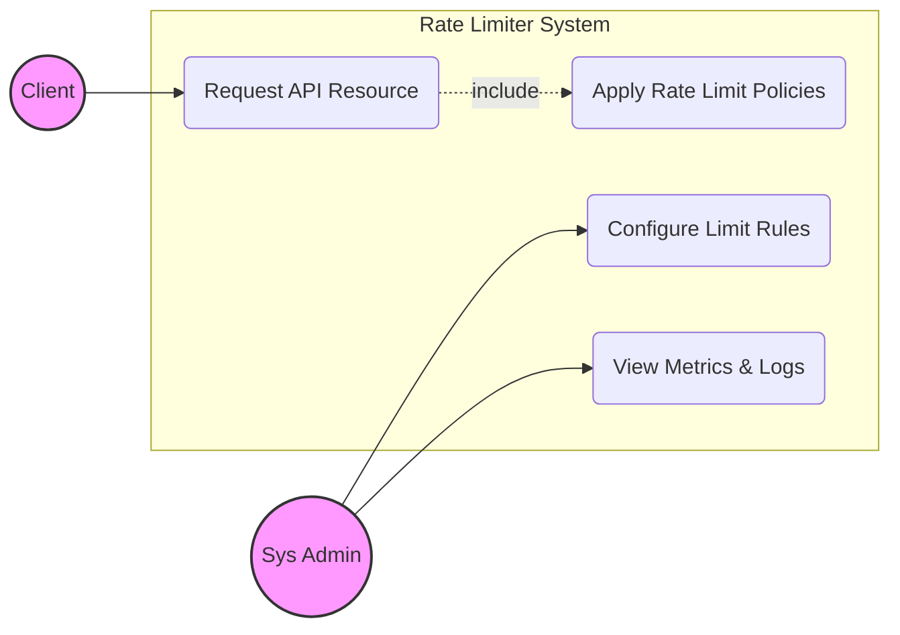
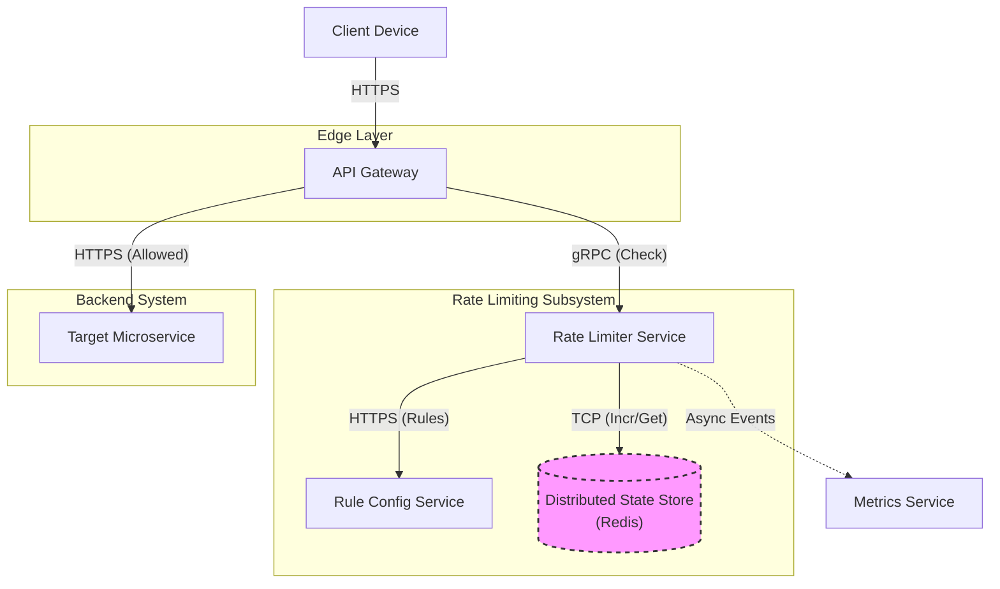
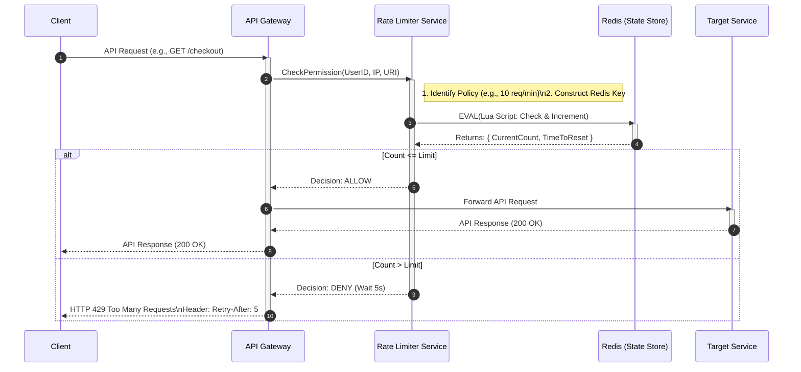
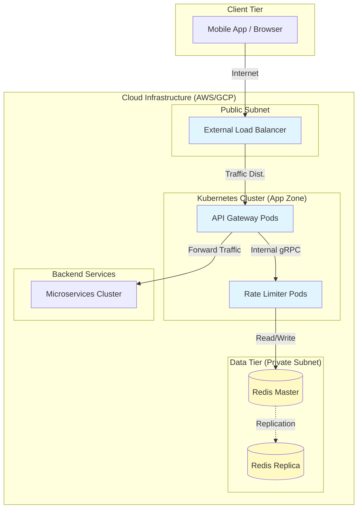

# 🛡️ High-Level Design: Distributed Rate Limiter

## 1. Overview

A Rate Limiter is a critical component in distributed systems designed to control the amount of incoming traffic to a service. It prevents abuse, ensures fair usage (preventing "noisy neighbors"), and protects backend services from being overwhelmed by unpredictable spikes in traffic.

**Core Architecture Decisions:**
* **Centralized State:** Uses Redis to hold counters, ensuring consistency across multiple rate limiter instances.
* **Low Latency:** Uses an in-memory store and efficient algorithms (Token Bucket/Sliding Window) to minimize the impact on the "Hot Path."
* **Fail-Open Strategy:** If the Rate Limiter service fails, traffic is allowed through to avoid a total system outage.

---

## 2. Use Case Diagram

### Explanation
This diagram describes the functional scope of the system.
* **Actors:** The Client (requesting resources) and the Admin (configuring rules).
* **Boundary:** The Rate Limiter system encapsulates the logic for checking, policy enforcement, and logging.

### Diagram

---

## 3. Component Diagram

### Explanation
This diagram illustrates the logical building blocks.
* **API Gateway:** Offloads the decision-making.
* **Rate Limiter Service:** Stateless decision engine.
* **Redis:** Stores the ephemeral counters.
* **Rule Config:** Stores the long-term policies (SQL/Cache).

### Diagram

---

## 4. Sequence Diagram (Request Flow)

### Explanation
This details the critical "Hot Path".
1.  **Check:** Gateway calls Rate Limiter.
2.  **Atomic Op:** Rate Limiter runs a Lua script in Redis.
3.  **Decision:** Gateway either forwards traffic or returns HTTP 429 immediately.

### Diagram

---

## 5. Deployment Diagram

### Explanation
This maps the software to the physical cloud infrastructure (AWS/GCP context).
* **Public Subnet:** Contains the Load Balancer.
* **Private Subnet:** Contains the application logic (Gateway, Rate Limiter) and Data tiers.
* **Redis Cluster:** Shows the primary/replica setup for high availability.

### Diagram
