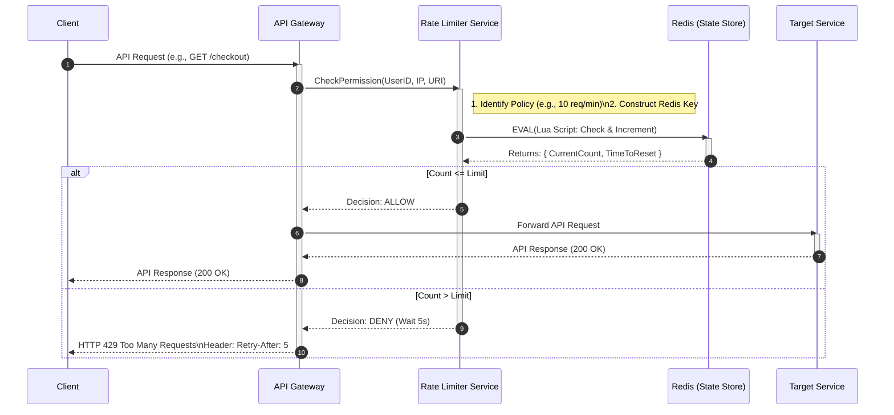

# 🛡️ High-Level Design: Distributed Rate Limiter

## 1. Overview

A Rate Limiter is a crucial component in distributed systems designed to control the amount of incoming traffic to a service or network. It prevents abuse, ensures fair usage (preventing "noisy neighbors"), and protects backend services from being overwhelmed by unpredictable spikes in traffic.

**Core Architecture Decisions:**
* **Centralized State:** Uses Redis to hold counters, ensuring consistency across multiple rate limiter instances.
* **Low Latency:** Uses an in-memory store and efficient algorithms (Token Bucket/Sliding Window) to minimize the impact on the "Hot Path."
* **Fail-Open Strategy:** If the Rate Limiter service fails, traffic is allowed through to avoid a total system outage.

---

## 2. Use Case Diagram

### Explanation
The Use Case diagram describes the functional scope of the system. It identifies who interacts with the system (Actors) and what they do.

* **Client:** The external entity (user, mobile app, or 3rd party service) sending API requests. They don't explicitly "call" the rate limiter; they just want the API resource.
* **System Administrator:** The internal user responsible for configuring rules (e.g., "Gold Users get 1000 req/s") and monitoring system health.

### Diagram
```mermaid
usecase diagram
    actor "Client" as client
    actor "System Administrator" as admin

    package "Rate Limiter System" {
        usecase "Request API Resource" as UC1
        usecase "Apply Rate Limit Policies" as UC2
        usecase "Configure Limit Rules" as UC3
        usecase "View Metrics & Logs" as UC4
    }

    client --> UC1
    UC1 ..> UC2 : <<include>>
    admin --> UC3
    admin --> UC4
```

---

## 3. Component Diagram

### Explanation
This diagram illustrates the logical building blocks and interfaces. It shows how the Rate Limiter decouples the Gateway from the Rule Configuration and the State Store.

* **API Gateway:** The entry point (e.g., Nginx, Kong, AWS API Gateway). It intercepts traffic and asks the Rate Limiter for permission.
* **Rate Limiter Service:** A stateless microservice. It fetches rules, calculates the algorithm, and returns `ALLOW` or `DENY`.
* **Rule Config Service:** A CRUD service managing the policy definitions (stored in a SQL DB or heavy cache).
* **Distributed State Store (Redis):** The most critical component for synchronization. It holds the "current count" for every user/IP. It must support atomic increment operations.
* **Metrics Service:** Asynchronously collects data (e.g., "User X was blocked") for analytics and alerting.

### Diagram
```mermaid
componentDiagram
    component [Client]

    package "Edge Layer" {
        component [API Gateway]
    }

    package "Rate Limiting Subsystem" {
        component [Rate Limiter Service]
        component [Rule Config Service]
        database "Distributed State Store\n(Redis Cluster)" as Redis
    }

    package "Backend" {
        component [Target Microservice]
    }
    
    component [Metrics Service]

    [Client] --> [API Gateway] : HTTPS (REST/GraphQL)
    [API Gateway] --> [Rate Limiter Service] : gRPC (Low Latency Check)
    [Rate Limiter Service] --> Redis : TCP (INCR/GET)
    [Rate Limiter Service] --> [Rule Config Service] : HTTPS (Fetch Policy)
    [Rate Limiter Service] ..> [Metrics Service] : Async Events (Kafka/SQS)
    
    note right of [API Gateway]
      Logic:
      1. Receive Request
      2. Call Rate Limiter
      3. If ALLOW -> Forward
      4. If DENY -> Return 429
    end note
    
    [API Gateway] --> [Target Microservice] : HTTPS (Filtered Traffic)
```

---

## 4. Sequence Diagram (The Request Flow)

### Explanation
This diagram details the dynamic behavior of a single request. This is the **Hot Path**, meaning every millisecond of latency added here slows down the entire application.

**Key Steps:**
1.  **Check:** The Gateway pauses the request and calls the Rate Limiter.
2.  **Atomic Op:** The Rate Limiter talks to Redis. It uses Lua scripting or atomic `INCR` to ensure that if two servers check the same user at the same time, the count is accurate (preventing Race Conditions).
3.  **Decision:**
    * **Happy Path (Allow):** The Gateway forwards the request to the backend.
    * **Rejection Path (Deny):** The Gateway immediately returns `429 Too Many Requests` with a `Retry-After` header. The backend is never touched.

### Diagram


---

## 5. Deployment Diagram

### Explanation
This diagram maps the software to the physical infrastructure. It emphasizes **High Availability (HA)** and **Scalability**.

* **Load Balancers:** Distribute traffic to prevent any single Gateway or Rate Limiter node from crashing.
* **Kubernetes Pods:** The Rate Limiter is containerized. If CPU usage spikes, K8s creates more replicas automatically.
* **Redis Cluster:** A single Redis instance is a Single Point of Failure. In production, we use a Redis Cluster (Sharded) or Sentinel (Primary-Replica) to ensure that if one cache node dies, the counts are preserved or failed over.
* **Zones:** Ideally, these components are spread across multiple Availability Zones (Data Centers) for disaster recovery.

### Diagram
```mermaid
deploymentDiagram
    node "Client Device" {
        [Browser / Mobile App]
    }

    cloud "Public Internet" {
        [DNS / CDN (Cloudflare)]
    }

    node "Load Balancer (AWS ALB)" as ELB

    node "Kubernetes Cluster" {
        node "Namespace: Gateway" {
            component [API Gateway Pods]
        }
        node "Namespace: RateLimiter" {
            component [Rate Limiter Pods]
        }
    }

    node "Data Tier (VPC Private Subnet)" {
        node "Redis Master" {
            database "Sharded Counters"
        }
        node "Redis Replica" {
            database "Replicated Counters"
        }
    }

    node "Backend Services" {
        [Microservices Cluster]
    }

    [Browser / Mobile App] --> [DNS / CDN (Cloudflare)]
    [DNS / CDN (Cloudflare)] --> ELB : HTTPS
    ELB --> [API Gateway Pods] : Traffic Distribution
    [API Gateway Pods] --> [Rate Limiter Pods] : gRPC
    [Rate Limiter Pods] --> [Redis Master] : Read/Write
    [Redis Master] ..> [Redis Replica] : Async Replication
    [API Gateway Pods] --> [Microservices Cluster] : Internal Traffic
```